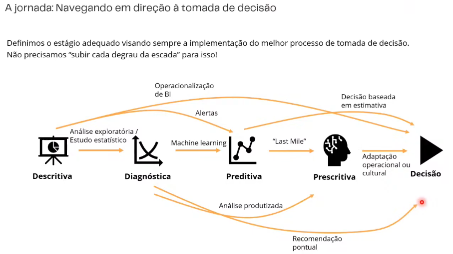

---
# BatCaverna Editor:
---

Salve esses dados em:
https://github.com/PedroVic12/Pikachu-Flask-Server/tree/main/batcaverna

Faça edições no [arquivo.MD ][var4] do repositório para atualizar o dashboard da BatCaverna PV 

[var4]: https://github.com/PedroVic12/Pikachu-Flask-Server/blob/main/batcaverna/batcaverna_pv.md

Aqui está o [link][var1] do Shiatsu como váriavel no .MD

[var1]: https://revigorar.reservio.com/

---

DATA ATUAL = 07/01/2025

__Altere as colunas do Kanban:__

**__BACKLOG, __IN_PROGRESS, __TODO, __COMPLETED**

Por default, fica sempre no backlog

---

## Roadmap Cientista de Dados

---

---
# BatCaverna Editor 2026
---

 
# PVRV 2026 - Planilha de horarios (atualizars)
- [x] Backup Kanban, Batcaverna, Linux e Win11
- [x] Planejamento e Metas semanal
- [ ] Listagem de projetos atuais por tecnologias do github
- [ ] Planejamento financeiro (Financial APP)
    - [x] Dezembro
    - [ ] Janeiro
    - [ ] Fevereiro
- [x] Organização Emails e Arquivos
- [x] Terapia janeiro 2026
- [x] Inserção de dados na base de dados LPP

 

---

# ONS PLC 2026 __IN_PROGRESS

Aqui está o [link do Sharepoint][var2] compartilhado

[var2]:https://onsbr.sharepoint.com/:f:/s/soumaisons/IgBdPCjxhJWGRoBDjV76pZApAdwZkzV_avBxKghxoYbQCaI?e=wcX7o3

- [ ] Testes para deploys de programas de automações da PLC
- [ ] Apoio na inserção de dados de restrições de novo Software feito pelo Fábio (06/01/26)

- [ ] Fazer preeenchimento da base de dados do LPP das ultimas duas tabelas do RSUL da planilha compartilhada
  - Limite
  - Condição
  - Governante
  - Nova função Base
  - Cadastro das: Função menor, maior e máx
  - 
- [ ] Conferir inequação resultante igual na planilha de RSUL

---

## LEGADO - ENG. ELÉTRICA - UFF, ONS, PIBIC, IoT Smart Grids

---

# UFF Engenharia Elétrica 2026.1
- [ ] Análise de contigencias PandaPower SIN 45
- [ ] Potencia Ativa x Reativa
- [ ] Equações P e Q e 7 principais
- [ ] Minicurso CC + Provas atingas circuitos 1 e 2 ordem EDO
- [ ] Estudos de Sistemas Elétricos de Potencia (SEP) (Fundamentos)
  - Potencia Ativa/ Reativa/ Aparente
  - Conceitos básicos de circuitos CA
  - Capacitores / Indxutores
  - Impedância, Indutância
  - Tap de transformadores na região de SP para controle de tensão
  - Equações principais para fluxo de potencia em diagrama unifilar
- [ ] Elementos do Eletromagnetismo
- [ ] Processamento digital de Sinais com Relés digitais e Series temporais de cargas de Substações
- [ ] Fazer prova de sistema de controle I da UFF com algebra linear básica na mão

- Cienstista de Dados

  __Atividades Práticas: ETL com Python, PySpark + SQL + Pandas para machine learning e relatórios automatizados__

Projeto 1 - Pipeline de Exploração de Dados e Operações SQL com Spark SQL
Projeto 2 - Banco de Dados, Machine Learning e Pipeline ETL em Cluster Spark Para Detectar Anomalias em Transações Financeiras
Projeto 3 - Pipeline de Machine Learning em Cluster Spark Para Previsão de Churn - Treinamento e Deploy
 Projeto 4 - Pipeline de Pré-Processamento, Validação Cruzada e Otimização em Machine Learning
Projeto 5 - Otimização de Pipeline ETL e Machine Learning com PySpark
Projeto 6 - Pipeline de Coleta, Transformação e Modelagem Preditiva em Tempo Real com Spark Streaming e TensorFlow
Projeto 7 - Data Lakehouse Time Travel com Apache Spark e Delta Lake
Projeto 8 - Deploy e Inferência de Modelos de Machine Learning com MLflow e Databricks
- [ ] Planejamento de horários de aulas
- [ ] Livros:

