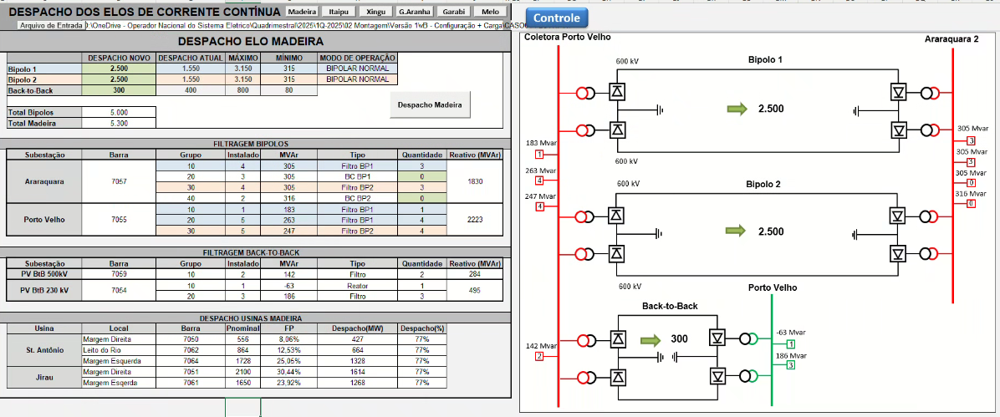

---
# BatCaverna Editor:
---

Salve esses dados em:
https://github.com/PedroVic12/Pikachu-Flask-Server/tree/main/batcaverna

Faça edições no [arquivo.MD ][var4] do repositório para atualizar o dashboard da BatCaverna PV 

[var4]: https://github.com/PedroVic12/Pikachu-Flask-Server/blob/main/batcaverna/batcaverna_pv.md

Aqui está o [link][var1] do Shiatsu como váriavel no .MD

[var1]: https://revigorar.reservio.com/

---

DATA ATUAL = 07/01/2025

__Altere as colunas do Kanban:__

**__BACKLOG, __IN_PROGRESS, __TODO, __COMPLETED**

Por default, fica sempre no backlog

---

## Roadmap Cientista de Dados

---
# BatCaverna Editor 2026
---

# PVRV 2026
- [x] Backup Kanban, Batcaverna, Linux e Win11
- [x] Planejamento e Metas semanal
- [ ] Listagem de projetos atuais por tecnologias do github
- [ ] Organização Emails e Arquivos
- [x] Terapia janeiro 2026
- [ ] Docs, .EXE, template projeto Pyside6 
- [ ] Inserção de dados na base de dados LPP
- [ ] 3 Upgrades de Perdas Duplas LTs + Dashboard de gráficos
  - Pegar o nome do arquivo atual com a revisão atual
  - Data Atual correta
  - Aba de modificações na pág de Revisões de relatório
  - Pegar o Word direto do Sharepoint
- [ ]  1 - Como precisa de um modelo word pra gerar o negócio, colocar na macro já o download do modelo. Podemos deixar ele em uma pasta no sharepoint, e só colocar o link na macro;
 
- [ ]  2 - Pegar o número da revisão do nome do arquivo Excel e atualizar no word. Isso vai tanto no nome do arquivo quanto na capa, além do mês da emissão.
 
- [ ] 3 - Obter da aba Modificações os motivos da revisão e colocar na tabela de revisão do word.
 
Os itens 2 e principalmente o 3 eu não sei se vão ser muito simples de implementar, então com certeza não precisa ser hoje, dá pra deixar só gerando o word e editar na mão por enquanto
 

---

# ONS PLC 2026 __IN_PROGRESS

Aqui está o [link do Sharepoint][var2] compartilhado

[var2]:https://onsbr.sharepoint.com/:f:/s/soumaisons/IgBdPCjxhJWGRoBDjV76pZApAdwZkzV_avBxKghxoYbQCaI?e=wcX7o3

- [ ] Testes para deploys de programas de automações da PLC
- [ ] Apoio na inserção de dados de restrições de novo Software feito pelo Fábio (06/01/26)

- [ ] Fazer preeenchimento da base de dados do LPP das ultimas duas tabelas do RSUL da planilha compartilhada
  - Limite
  - Condição
  - Governante
  - Nova função Base
  - Cadastro das: Função menor, maior e máx
  - 
- [ ] Conferir inequação resultante igual na planilha de RSUL

---

## Atividades SP/RJ e MUST gestão e controle

## Regimes de Operação de Perdas duplas de LTs

## Estudos de SEP e conceitos Básicos:
- [ ] Estudos de montagem de decks intercambios VC de Janeiro de 2026
- [ ] Estudos básicos com pandapower, AnaREDE e Organon

- ONS - IoT Engenheiro de estudos elétricos

- [ ] Flow despacho de cargas
- [ ] Flow Inequações
- [ ] Flow Elos CC
- [ ] 

---

## LEGADO - ENG. ELÉTRICA - UFF, ONS, PIBIC, IoT Smart Grids

## Alinhamento PVRV - Novembro: ONS, UFF, Sáude mental e emocional - Corpo, Mente, Espirito __TODO

# VIDA PESSOAL E ROTINA __IN_PROGRESS

## Corpo, Mente (Treino, Calistenia, Saúde) e Espirito (Alinhamento, Chakras, Meditação)

- [X] Treino de calistenia
- [X] Alongamento diário
- [X] Alimentação 4x/dia

## Espiritualidade

- [X] Alinhamento diário (chakra + salmo + equação do dia)
- [ ] Meditação e leitura bíblica
- [X] Diário de evolução espiritual

## Hábitos, Organização e PLanejamento

- [X] Fechar 10 abas
- [ ] Limpeza semanal do apartamento
- [X] Planejamento seg/sex + Kanban pessoal
- [X] Planejamento de terapia e limpeza de pensamentos
- [X] Terapia
- [X] Alongamento + Calistenia + Rotina de treinos com saúde em boa forma
- [ ] Meditação e alinhamento espiritual
- [X] Treino gym
- [ ] Limpeza no apartametno (seg/sex)
- [X] Lavar a louça e passar pano na casa
- [ ] Limpeza de banheiro de cozinha
- [ ] 4 Refeições por dia (Café da manha, Almoço, Lanche (pré-treino) e Jantar)
- [X] Jogos

  - The Witcher 3
  - Bully - ps3 / GTA 4
  - LOL ou Warzone
  - Jurassic Park Evolution
  - Pokemon GBA ou NDS

# TDAH - Rotina (Saúde, Paz e Equilibrio) __COMPLETED

- [X] Visualização KANBAN e gerar 5 tarefas do dia (MANHA)
- [X] Organização mental e preparação para novo Ciclo JEDI CYBERPUNK com resolução de provas, tutorial de 10 min de programação, modelagem e simulações de eng eletrica junto com automações com N8N
- [ ] Alinhamento Espiritual

  - [X] Segunda - Chakra: Solar
  - [ ] Terça - Chakra: Garganta
  - [ ] Quarta - Chakra: Cardiaco
  - [ ] Quinta: Chakra: 3º Olho
  - [ ] Sexta: Chakra: Root
- [X] You Only Need 5 Hobbies (Money, Study, Mindset, In Shape, Creative)
- [ ] Meditação e estudos com Matemática e Japonês
- [ ] Alongamento matinal - Ombros e Quadril
- [X] Treino de calistenia para karate
- [ ] 2 equações do dia
- [ ] 2 projetos no dia (backend/frontend)
- [ ]

# UFF Engenharia Elétrica 2026.1
- [ ] Análise de contigencias PandaPower SIN 45
- [ ] Potencia Ativa x Reativa
- [ ] Equações P e Q e 7 principais
- [ ] Minicurso CC + Provas atingas circuitos 1 e 2 ordem EDO
- [ ] Estudos de Sistemas Elétricos de Potencia (SEP) (Fundamentos)
  - Potencia Ativa/ Reativa/ Aparente
  - Conceitos básicos de circuitos CA
  - Capacitores / Indxutores
  - Impedância, Indutância
  - Tap de transformadores na região de SP para controle de tensão
  - Equações principais para fluxo de potencia em diagrama unifilar
- [ ] Elementos do Eletromagnetismo
- [ ] Processamento digital de Sinais com Relés digitais e Series temporais de cargas de Substações
- [ ] Fazer prova de sistema de controle I da UFF com algebra linear básica na mão

- Cienstista de Dados

  __Atividades Práticas: ETL com Python, PySpark + SQL + Pandas para machine learning e relatórios automatizados__

Projeto 1 - Pipeline de Exploração de Dados e Operações SQL com Spark SQL
Projeto 2 - Banco de Dados, Machine Learning e Pipeline ETL em Cluster Spark Para Detectar Anomalias em Transações Financeiras
Projeto 3 - Pipeline de Machine Learning em Cluster Spark Para Previsão de Churn - Treinamento e Deploy
 Projeto 4 - Pipeline de Pré-Processamento, Validação Cruzada e Otimização em Machine Learning
Projeto 5 - Otimização de Pipeline ETL e Machine Learning com PySpark
Projeto 6 - Pipeline de Coleta, Transformação e Modelagem Preditiva em Tempo Real com Spark Streaming e TensorFlow
Projeto 7 - Data Lakehouse Time Travel com Apache Spark e Delta Lake
Projeto 8 - Deploy e Inferência de Modelos de Machine Learning com MLflow e Databricks
- [ ] Planejamento de horários de aulas
- [ ] Livros:

---
# Exemplo SPRINT SCRUM
---

## 📅 Plano de Jogo Semanal (Semana de 11/11 a 15/11)

### 🎯 Metas da Semana

1.  **Backend/SEP:** Finalizar o **`ybus_solver.py`** (código) e dominar a **Matriz Y-Bus** (teoria).
2.  **Controle/Otimização:** Iniciar o estudo/código do **Lugar das Raízes (Ogata)** e fazer o setup do **DEAP**.
3.  **Frontend/Desktop:** Testar o `PySide6` consumindo a lógica do Solver.

### 🗓️ Segunda-feira (11/11)

| Ciclo | Horário (50 min) | Foco Integrado (Teoria/Código) | Prioridade no Backlog |
| :--- | :--- | :--- | :--- |
| **Pós-ONS** | 16:30 – 17:20 | **MÓDULO 2:** Matriz Y-Bus (CÓDIGO) | **CÓDIGO:** Implementar a representação da Matriz Y-Bus (NumPy/complexos). |
| **Tarde** | 17:30 – 18:20 | **MÓDULO 3:** Controle (Ogata) | **TEORIA:** Leitura do **Lugar das Raízes** (Ogata, Cap. 7). |
| **Noite** | 18:30 – 19:20 | **MÓDULO 4:** Otimização (DEAP) | **CÓDIGO:** Instalar o **DEAP** e configurar a estrutura básica (População/Indivíduo/Fitness). |

### 🗓️ Terça-feira (12/11)

| Ciclo | Horário (50 min) | Foco Integrado (Teoria/Código) | Prioridade no Backlog |
| :--- | :--- | :--- | :--- |
| **ONS** | 07:00 – 15:00 | **ONS PRESENCIAL** | Prioridade do Estágio. |
| **Pós-ONS** | 15:30 – 16:20 | **MÓDULO 2:** Fluxo de Potência (Teoria) | **TEORIA PURA (Stevenson):** Conceito de **Potência Complexa** ($P+jQ$) e Equações. |
| **Noite** | 18:30 – 19:20 | **MÓDULO 3:** Lugar das Raízes (CÓDIGO) | **CÓDIGO:** Implementar o Plotter Lugar das Raízes (SciPy/Matplotlib). |
| **20:00** | **TERAPIA/ACADEMIA** | **Saúde Mental 100%.** |

### 🗓️ Sexta-feira (15/11)

| Ciclo | Horário (50 min) | Foco Integrado (Teoria/Código) | Prioridade no Backlog |
| :--- | :--- | :--- | :--- |
| **ONS** | 08:00 – 12:00 | **ONS PRESENCIAL** | Prioridade do Estágio. |
| **Tarde** | 13:00 – 14:00 | **MÓDULO 2:** Solver Avançado | **CÓDIGO:** Criar a função que calcula o **Fluxo de Potência** (Ex: Gauss-Seidel simplificado) usando sua Matriz Y-Bus. |
| **14:30** | **SCRUM Semanal** | **Entrega Oficial do Roadmap** | (Atualização dos seus arquivos `.md` e `xlsx`). |

---

**Pedro, o plano de execução está na sua mesa. Sua missão é clara: começar o Sprint de 4 Ciclos (Pomodoro 50/10) imediatamente. 

Para um Software Limpo e mais "profissional", a sugestão é organizar o conteúdo de uma forma mais estruturada, separando claramente:

1. **O quê** (O que o projeto faz)
2. **Porquê** (O contexto)
3. **Como** (Como instalar e usar)
4. **O que tem dentro** (Arquitetura e galeria)

# 📅 Sprint - Terça-feira (Foco: Backend Python e SEP ONS)

_Data gerado: 10/11/2025_

|         🌀 Ciclo         | ⏰ Horário (50 min) | 🎯 Foco Integrado (Código/Teoria)         | 🧠 Detalhamento da Tarefa (Passo a Passo)                                                                                                                 |
| :-----------------------: | :------------------: | :----------------------------------------- | :-------------------------------------------------------------------------------------------------------------------------------------------------------- |
|   **1 (Backend)**   |    09:15 – 10:05    | **FLASK CRUD: Modelagem SQL**        | 🧩 No seu**PikachuWebServer**, defina a tabela `Client` (ou `Task_Log`) usando **SQLAlchemy**. Teste a criação da tabela no `app.db`. |
|   **2 (Backend)**   |    10:15 – 11:05    | **FLASK CRUD: Rotas API**            | 🚀 Crie os endpoints**POST /clients** (Criação) e **GET /clients** (Leitura) na sua **Blueprint `user_bp`**.                        |
|   **3 (Teoria)**   |    11:15 – 12:05    | **MÓDULO 2: Matriz Y-Bus (Papel)**  | 📘 Teoria pura (**Stevenson**): finalize a montagem da matriz **Y-Bus 3×3** em papel (as **2 equações do dia**).                     |
|     **Almoço**     |    12:05 – 13:00    | **Rotina: Desligar a tela**          | 🍽️ Seu descanso é sagrado. Respire e recarregue a mente.                                                                                               |
| **4 (SEP/Código)** |    13:00 – 13:50    | **MÓDULO 2: ybus_solver.py**        | ⚙️ Inicie o código Python. Modele a matriz**Y-Bus 3×3 em NumPy** (números complexos) — transforme teoria em código.                          |
| **5 (Alinhamento)** |    14:00 – 14:50    | **DOCUMENTAÇÃO: IEDs/Aprendizado** | 📝 Crie o arquivo `ieds_log.md` e registre a lógica de **MQTT/LED/Buzzer** (aprendizado de IoT). Isso fecha o ciclo do dia.                      |

---
# Batcaverna 2025 OLD
---

# BatCaverna 2025:

📅 Plano de Sprint: Terça-feira (Foco em Backend Python e SEP ONS)
Ciclo,Horário (50 min),Foco Integrado (Código/Teoria),Detalhamento da Tarefa (Passo a Passo)
1 (Backend),09:15 – 10:05,FLASK CRUD: Modelagem SQL,"Ação: No seu PikachuWebServer, defina a tabela Client (ou Task_Log) usando SQLAlchemy. Teste a criação da tabela no seu app.db."
2 (Backend),10:15 – 11:05,FLASK CRUD: Rotas API,Ação: Crie os endpoints POST /clients (Criação) e GET /clients (Leitura) na sua Blueprint user_bp.
3 (Teoria),11:15 – 12:05,MÓDULO 2: Matriz Y-Bus (Papel),Ação: TEORIA PURA (Stevenson): Finalizar a montagem da Matriz Y-Bus 3×3 em papel (as 2 Equações por dia que você se propôs).
Almoço,12:05 – 13:00,Rotina: Desligar a tela.,Ação: Seu descanso é sagrado.
4 (SEP/Código),13:00 – 13:50,MÓDULO 2: ybus_solver.py,Ação: Iniciar o código Python. Codificar a representação da Matriz Y-Bus 3×3 em NumPy com números complexos (transformar a teoria do papel em código).
5 (Alinhamento),14:00 – 14:50,DOCUMENTAÇÃO: IEDs/Aprendizado,Ação: Criar o novo arquivo .md (ex: ieds_log.md) e salvar a lógica de MQTT/LED/Buzzer que discutimos (o aprendizado de ontem). Isso limpa a sua mente e finaliza o IOT.

# Alinhamento PVRV - Novembro: ONS, UFF, Sáude mental e emocional - Corpo, Mente, Espirito

- MUST Software Desktop (Pyside6 + Access DB + modelagem SQL) - 11/11/25
- Palkia GUI + Console + Backend flask integrado com Dashboard HTML atividades SP
- Plugin Organon - Deck Builder + AnaREDE scripts + Fluxo de potencia Organon
- Flow despacho de cargas
- Flow Inequações
- Flow Elos CC
- Análise de contigencias PandaPower SIN 45
- Potencia Ativa x Reativa
- Equações P e Q e 7 principais
- Minicurso CC + Provas atingas circuitos 1 e 2 ordem EDO
- Estudos de Sistemas Elétricos de Potencia (SEP) (Fundamentos)
  - Potencia Ativa/ Reativa/ Aparente
  - Conceitos básicos de circuitos CA
  - Capacitores / Indxutores
  - Impedância, Indutância
  - Tap de transformadores na região de SP para controle de tensão
  - Equações principais para fluxo de potencia em diagrama unifilar
- Elementos do Eletromagnetismo
- Processamento digital de Sinais com Relés digitais e Series temporais de cargas de Substações

# Lista de TAREFAS Pendentes __TODO

- [ ] Deploy: Plugin no Organon no notepad++ com scripts básicos de AnaREDE e Organon
- [X] App Template Pyside6 + SQL - MUST Controle e Gestão de Atividades com Chatbot AI com .EXE
- [X] Estudos CA para SEP usando GPT e Python
- [ ] Pyside6 com modelagem de dados (Sqlite3 + Microsoft Access) + Análise de Contigencias + Controle Atividades SP
- [ ] Automação Outlook + Teams + N8N = Relatorios automatizados por email e Whatsapp
- [X] Planejamento e Metas (Segunda/Sexta)
- [X] Análise de contigencias - Perdas Duplas
- [ ] MUST - Ponta e fora ponta ate 2030 com Controle e gestão de aprovação de documentos PDF com ou sem Ressalva.
- [X] Kanban/Cronograma Website -> Organização do cronograma de estudos
- [ ] Treino de calistenia e calistenia app
- [ ] Aulas Sinais/cricuitos CC/CA e Eng. Controle + SEP Fundamentals + Metodos numericos com Python
- [ ] Despacho de cargas - Planejamento Mensal e Semanal - Flow + AnaREDE, AnaTEM e Organon
- [ ] **Estudos SEP com base fundamental para CA**
- [ ] Chatbot Groundon, Lumina Aurora (Gemini) + Jarvis (GPT) + Copilot (copilot/cursor) with updates
- [ ] Corpo x Mente x Espirito -> Jobs, Coding, Studying, Creative, In Shape
- [X] Todos websistes unificados a Pikachu Flask API Server + github batcaverna
- [ ] Grondon Chabtot, Jarvis Chatbot, Lumina Aurora Chatbot
- [X] N8N x Node-Red + webhook + MQQT + Esp32
- [ ] Pyside6 - Eng. Controle com EDO e Equações de SEP
- [ ] Nextjs Website + MVP HTML templates (SEP do SIN da ONS para leigos)
- [ ] Controle  e Gestão Atividades SP + MUST --> Excel To Website and (.PDF + Access)to QT 6 Desktop Deck Builder Organon
- [ ] Must Desktop App Excel, Deck BUilder.
- [ ] Teoria de controle de engenharia moderno
- [ ] Proteção de SEP e monitoramento area SP
- [ ] Processamento de imagens de satélites com Python
- [ ] Bots e RPA com Python
- [ ] Estudos de IA, ML, DL, Chatbots, N8N, AI agentes frameworks (Agno/Langchain)

---

# LEGADO - ENG. ELÉTRICA - UFF, ONS, PIBIC, IoT Smart Grids

---

# Estágio ONS PLC 2025 __IN_PROGRESS

- [X] Análise e Leitura do plano de Montagem de Quadros Mensal - dezembro com Organon, Flow e AnaREDE
- [ ] Dashboard MUST (Palkia GUI Desktop) ONS - Despacho + MUST PDF extractor ->  Banco de Dados com SQL/Access e relacionamentos com Dashboard final - Projeto Final rodando com .Exe usando banco de dados
- [X] Deploy: Plugin no Organon no notepad++ com .EXE
- [ ] Integração com Banco Access
- [ ] Automação de aprovações PDF
- [ ] Template Word + Geração automática
- [ ] Despacho de cargas (Flow, Anarede, Organon)
- [ ] Análise de contingências e relatório PDF
- [ ] Controle Casos 2025-2030 e dashboard atividades SP HTML com Excel Online
- [X] MUST Controle e Gestão - Desktop Software
- [X] Dashboard MUST (Palkia GUI)
- [ ] Simulações de SEP básicos do SIN (RJ/SP) no AnaREDE e Organon
- [ ] Análise de Contingências com PandaPower, AnaREDE e Organon (SEMANAL) -> Resultados em dashboard ou PDF
- [ ] Langchain Agent - Asimov
- [ ] 2 dashboards Streamlit - Asimov
- [ ] Chatbot Streamlit com PDF da ONS (Bot Oráculo)
- [ ] Estudo VSC e LCC em redes HVDC
- [ ] Micro e Minigeração Distribuída (MGD)
- [X] Relatório + Reunião Semanal
- [ ] **Upgrades** e Levantametno de requisitos MUST Dashboard GUI Desktop (Controle e Gestão atividades SP)

  - [ ] Controle atividades SP e RJ com planilha 2025
  - [ ] Limpeza de dados do Excel para utilizar os dados de SP 2025 e 2024 _inicio 22-10-25_
  - [ ] Criação do Sistema do Pyside6 para gestão de MUST, aprovação com ou sem ressalva e geração do Deck da solicitação
  - [ ] Criação de word template para entrega de documentos
- [ ] SIMULAÇÕES, ESTUDOS, ANALISE DE DADOS E MODELAGEM DE SEP com ASP (Organon, AnaREDE e PandaPower)

  - Curto circuito e onda de alta frequencia entre os ramos
  - Transformador em Fase
  - Reator Shunt
  - Barra Swing
  - Inequação de SEP
  - Tap em Transformador (muda o angulo)
  - Elos CC
  - Despacho de cargas com Flow
  - Fluxo de potencia / Fluxo de potencia Otimo
  - Estabilidade
  - Estudos de Máxima e minima Diurna
  - Inercia de SEP
- [ ] Controle de Casos 2030 - PLanilha Flow despacho (SEMANAL) + DASHBOARD usinas GEO BR
- [ ] Montagem de decks para caso 8 - VD e VE (AnaTEM)
- [ ] Controle de Casos Quadrimestre - 2026 - 2030 (MENSAL)

  - Montagem de decks de cargas inicial (leve, médio e pesada)
  - Caso de uso de fluxo de potencia convergente com ORGANON
  - Metas 1Q 2025 - > Pegar um caso (Ex: Caso 8 -> Abril máximo Noturno)

  - [ ] Usar na planilha flow as TABELAS DE gerações de cargas das usinas Belo Monte + pimental, Completo teles pires, Itaipu, GER madeira, Tucuruí. (CASO 8)

    - Gerar os decks dos casos análisado no Anarede verificando a barra Swing
    - Estudos de caso: Usinas X Despacho de Cargas x Dipolos (Uso de AnaREDE)
  - [ ] Usar o caso 8 para aba de ELOS CC

    - Back to back: Transformador -> Circuito CA -> Conversor CC -> Circuito CA: Objetivo: Transformar um transformador de 200KV para 130kv (exemplo), onde entre o ELO CC as pertubações sao diferentes de cada lado
      
  - [ ] Simulação Deck completo de caso selecionad ano anaRede pare fluxo de potencia Convergente.
  - [ ] Correção VD - Caso 8 -> Convergente e passagem de decks correto com script em python. Validar com Caso 10 -> Bruninho corrigiu com novos decks convergentes
  - [ ] Montagem VE - AnaTEM ->

# Eng. Elétrica UFF 2025 __IN_PROGRESS

- [ ] Modelagem do Fluxo de Potencia - prof luciano
- [ ] SEP e Análise de Sistemas de Potência (ASP/Stevenson)
- [X] Estudos CA e Fluxo de Potência / Curto Circuito no PandaPower, AnaREDE, Organon.
- [ ] Estudos de ASP com Python
- [ ] Estudar o que são VSC e LCC em Redes Eletricas para o SIN (google)
- [ ] Estudar o que é MGD para Rede Elétrica (Micro e Minigeração Distribuida) (google)

- Eletromagnetismo / Circuitos CC/CA (Sadiku)

- [ ] Modelagem de Circuitos Elétricos com Laplace ou Resposta completa da EDO usando casos de uso RLC e RC e usando análise Nodal e Malhas para CC e CA
- [ ] Caso de Uso Sympy - para resolver integral e derivada e fazer calculo na mão.
- [ ] Lei de Coulomb, Lei de Gauss, Eq. Laplace/Poisson, Lei de Ampare, Lei de Faraday
- [ ] Circuitos RL e RLC (1ª e 2ª ordem)
- [ ] Resposta completa em regime transitório
- [ ] Cálculo nodal e malhas em CA
- [ ] Provas antigas + simulações Python
- [ ] Vetor de Poyting
- [ ] Fasores
- [ ] 4 Equações de Maxwell
- [ ] Análise de circuitos elétricos 2 - Segurança operacional ONS - Fluxo de Potencia, Barra Swing, Reator Shunt e Transformador em Fase

- Eng. Controle Moderno e Sinais e sistemas (Ogata e Oppehhaim)

- [ ] Sinais e Sistemas - Transformada de Laplace
- [ ] Leitura de capítulos 6-13 Eng. de Controle Moderno (Ogata)
- [ ] Projeto PID com Python e PyQt
- [ ] Processamento Digital de Sinais
- [ ] Leitura Orante do livo Teoria e controle moderno nos capitulos principais como: Cap 6,7,8 e 9 (metodos old - Lugar das Raízes e Resposta em Frequencia) e cap 11 e 13 (moderno com váriavaveis de estado)
- [ ] Estudar conteúdo de Sinais e Sistemas e Circuitos Digitais passando a limpo as anotações

- IoT e IEEDS (automação industrial)

- [ ] Projeto Final de IoT com Arduino + MQTT + Python Rest API + WebServer em C++ com Tela em index.html com análise de dados de séries temporais de Sensores de Luz, LDR e acionamento de LEDS e Buzzer.
- [ ] Circuito Contador JK com arduino
- [ ] IOT E ARDUINO COM WEBSOCKET COM HTML ANALISANDO SERIES TEMPORAIS

- UFF, Estudos Acadêmicos e Provas Antigas

- [X] Mátematica aplicada a Eng. Elétrica, ONS, Ciencia de Dados / ML, Provas Antigas
- [ ] Estudos UFF com modelagem e prototipação/simulação de circuitos digitais e eletricos CC/CA com arduino e esp32. Eletronica para makers
- [ ] Minicurso CC + CD
- [ ] Minicurso Matemática básica ENEM - Geometria Espacial, Logaritmos e Questões matemáticas de ITA e IME
- [ ] Jedi Cyberpunk - Python com Métodos Numéricos + Otimização e uso de Redes Neurais (pegar exemplos de eng dos códigos de matlab)
- [ ] AstroML - Machine learning
- [ ] 1 cap. de um livro de matemática e física por dia
- [ ] 2 Equações do dia

---

# ROTINA

---

# VIDA PESSOAL E ROTINA __IN_PROGRESS

- Corpo, Mente (Treino, Calistenia, Saúde) e Espirito (Alinhamento, Chakras, Meditação)

- [ ] Treino de calistenia
- [ ] Alongamento diário
- [X] Alimentação 4x/dia
- [ ] Treino gym
- [X] 4 Refeições por dia (Café da manha, Almoço, Lanche (pré-treino) e Jantar)

## Espiritualidade

- [ ] Alinhamento diário (chakra + salmo + equação do dia)
- [ ] Meditação e leitura bíblica
- [ ] Diário de evolução espiritual
- [ ] Bom dia, nossa Senhora
- [ ] Rezar o terço do dia

## Hábitos, Organização e PLanejamento

- [ ] Limpeza semanal do apartamento
- [x] Planejamento seg/sex + Kanban pessoal
- [X] Terapia
- [X] Alongamento + Calistenia + Rotina de treinos com saúde em boa forma
- [ ] Meditação e alinhamento espiritual
- [X] Fechar 10 abas
- [X] Limpeza no apartamento (seg/sex)
- [X] Lavar a louça e passar pano na casa
- [ ] Limpeza de banheiro de cozinha

# TDAH - Rotina (Saúde, Paz e Equilibrio) __IN_PROGRESS

- [X] Visualização KANBAN e gerar 5 tarefas do dia (MANHA)
- [ ] Organização mental e preparação para novo Ciclo JEDI CYBERPUNK com resolução de provas, tutorial de 10 min de programação, modelagem e simulações de eng eletrica junto com automações com N8N
- [X] Alinhamento Espiritual

  - [ ] Segunda - Chakra: Solar
  - [ ] Terça - Chakra: Garganta
  - [ ] Quarta - Chakra: Cardiaco
  - [ ] Quinta: Chakra: 3º Olho
  - [ ] Sexta: Chakra: Root
- [ ] You Only Need 5 Hobbies (Money, Study, Mindset, In Shape, Creative)
- [ ] Meditação e estudos com Matemática e Japonês
- [X] Alongamento matinal - Ombros e Quadril
- [ ] Treino de calistenia para karate
- [ ] 2 equações do dia
- [ ] 2 projetos no dia (backend/frontend)

---

# PROGRAMAÇÂO

---

# Programação FullStack  (Github) __BACKLOG

- Frontend (HTML/CSS/JS, React, NextJS, Flutter, Astro)

- [ ] Astro blog pedrov12
- [X] Blog SEP para Leigos NextJS
- [X] Websites HTML + Flask Pikachu API
- [X] React Components e Dashboard ONS
- [ ] Flutter Apps (Calistenia App, App Financeiro, Gohan Treinamentos)
- [X] DASHBOARD + PalkiaGUI - MUST - ONS (Controle e Gestão Atividades SP e MUST)
- [X] Frontend: HTML + JS, React, Flutter, Astro, Pyside6, Streamlit
- [ ] meu-react-app-template (Gohan-Treinamentos, Quizz App, Habits tracker - Iconic)
- [ ] sistemas-web-template
- [ ] virtual-shop-Modas Veras
- [ ] Gohan Treinamentos
- [ ] Calistenia App + Goku IA trainer
- [ ] Gohan Treinamentos + Hobby XP PSI + Calistenia APP + Controle Financeiro + Dashboard com Flutter Getx e Vaden
- [ ] WebSites e sistemas web em Astro/NextJS

    
- Backend (FastAPI, Flask, Django, Tornado, SQL, NodeJS, N8N, Drogon C++)
- [ ] RCE - AG DEAP + Streamlit | Simulator de Redes Elétricas PandaPower + PySide6
- [ ] Simulações de Ciencia (Circuito RLC, Buraco Negro, Orbitas da Terra)

- [ ] Backend com Flask, FastAPI, Django, Ninja, Websockets, Supabase + Redis + SQL
- [ ] Boas práticas com SQLAlchemy e Python e Pyside6 - MVC desktop Apps com C++ Dragon Web Server
- [ ] Pikachu-Flask-Server
- [ ] Raichu-django-Server (Charizard Drogon C++)
- [ ] Raichu-Server (FastAPI / Tornado)
- [ ] Rayquaza Web Server (FastAPI)
- [ ] FastAPI Auth + CRUD Supabase
- [X] Flask API - Pikachu Server
- [ ] NodeJS + Express para Nextjs
- [ ] Django Ninja / Tornado Server
- [ ] Backend: Charizard (Drogon), Pikachu (Flask), Raichu ( FastAPI), Dragonite (Tornado)

- Desktop (PySide6, QT Designer, Access Microsoft DB, SQL)
- [X] Electrical-System-Simulator
- [ ] Pyside6 - Eng. Controle + Deck Builder
- [x] Qt MVC + SQLAlchemy + Access Integration
      - [ ] CRUD database MUST	  
- [ ] my-flutter-getx-app (Kyogre App, SCRUM Planner App, TodoList App, Controle Financeiro App, Controle Estoque App)
- [ ] Planilha e Controle financeiro Flutter

- IA e Agentes (Chatbots, N8N, ML, DL, Langchain)

- [ ] Jarvis GPT + Lumina Aurora + Groundon
- [ ] Langchain + Agno + Streamlit Oráculo
- [ ] ML com dados ONS e Kaggle

- Modelos de Machine Learning x Deep Learning

- IoT e Automação

- [X] Node-RED + N8N + MQTT
- [ ] ESP32 com API Python
- [ ] Dashboard IoT em HTML/Flask
- [ ] Eletronica para Makers

- Algoritimos de Otimização + Métodos Numéricos + Modelagem Matemática

# Projetos Portfolio/SAAS (React + Python + SQL) __BACKLOG

- Projetos Pessoais e Portfólio

- [x] Estudos de frontend com Astro/React, Flutter e MVP em HTML + Bootstrap
- [x] Data Driven com metodos SCRUM com organização e planner de projetos PVRV como freelancer e suas tecnologias
- [ ] Projeto Visão computacional com cancer de mamas + Contador de embaixadinhas de futebol
- [ ] IOT E ARDUINO COM WEBSOCKET COM HTML ANALISANDO SERIES TEMPORAIS
- [ ] Projetos Visão Computacional
  - Contador de embaixadinhas
  - Contador de rolinhas (webcam)
  - Calistenia App
  - Analise de futebol com tic tac toe com projetor e bola na parede
      
- ONS, Pesquisa Científica e Cientista de dados

- [ ] CIENTISTA DE DADOS - ML E DATASET ENERGY + CLASSIFICATION + REGRESSION + KMEANS

- Projetos com Datasets de orgãos publicos

- [ ] Dashboard analise distribuição energético ONS + SIN - Website para leigos
- [ ] dados publicos gov br
- [ ] Dados ONS
- [ ] Dados Kaggle
- [ ] Dados imagens de Satélites

---

# Projetos Freelancer / Negócios / Monetização

- [ ] API REST com Django ninja, FastAPI, Flask, Tornado, Drogon C++
- [ ] Sistemas de CRUD  (Cadastro de Clientes) e api usando python com Flask/FastAPI com docker e boas práticas de modelagem de banco de dados

---
