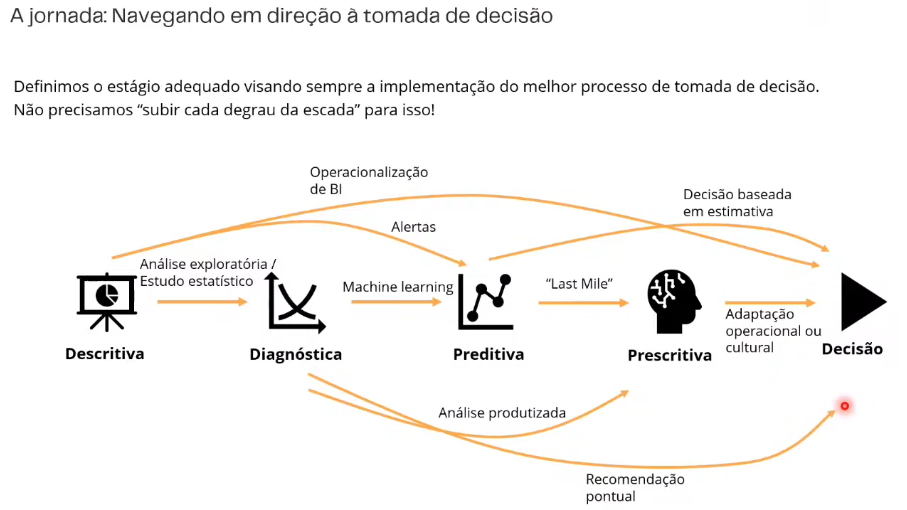

# 🦇 BatCaverna PV - Centro de Comando 2026
---

**📅 DATA ATUAL:** 06/04/2026
**🔗 Repositório:** [GitHub Repository][var4]
**📋 Shiatsu Link:** [Agendamento Shiatsu][var1]
**📊 Kanban Columns:** `__BACKLOG` | `__IN_PROGRESS` | `__TODO` | `__COMPLETED`
**🎯 Default Status:** Backlog

[var4]: https://github.com/PedroVic12/Pikachu-Flask-Server/blob/main/batcaverna/batcaverna_pv.md
[var1]: https://revigorar.reservio.com/

---

## 📑 ÍNDICE RÁPIDO

### ⚡ **TRABALHO - ONS PLC 2026**

* 📋 [Tarefas ONS PLC](#tarefas-ons-plc-2026)

### 🎯 **PROJETOS GITHUB**

* [Projetos GitHub](#projetos-github)

### 🎯 **DESENVOLVIMENTO PESSOAL**

* 📚 [Sessão de ESTUDOS](#sessao-de-estudos-matematica-programacao-e-eng-eletrica)

### 📅 **PLANEJAMENTO SEMANAL**

* 📋 [Checklist Diário](#checklist-diario)

### 🎯 **LINKS WEBSITES**

* <https://www.mat.ufmg.br/futebol/classificacao-para-libertadores_seriea/>
* <https://gohan-treinamentos-web-app-one.vercel.app/home>
* <https://electrical-system-simulator.vercel.app/>

### 🔧 **OUTRAS SEÇÕES**

* 📊 [Roadmap Cientista de Dados](#roadmap-cientista-de-dados)
* ⚡ [Conceitos Fundamentais de Eng. Elétrica](#sessao-de-estudos-matematica-programacao-e-eng-eletrica)

---

## 🎓 Roadmap Cientista de Dados

---

# 🦇 Batcaverna PV - Centro de Comando 2026

## Sprint Atual (06/04/2026) - Tarefas PLC 2026

- [ ] Diagrama SP - Organon 440KV
- [ ] Tarefas e apoio Atividades mensal VA,VB e VC - Maio 2026
  - [ ] Fazer despacho na Flow usando dados VA para Pesada e Media
  - [ ] Refazer Pesada (conferir) e usar o caso de Média ncom a politica energetica
  - [ ] Complexo madeira e tirar duvidas com o marcos no caso de Pesada e Média
  - [ ] Preparação da VB depois da politica energetica com despacho usando dados SEMENTE do VA
     
           
- [ ] Estudos SEP com Eng eletrica e Matematica avançada
- [ ] Kanban, SCRUM, Reunioes e alinhamento espiritual
- [ ] Rotina TDAH com foco no espirito durante a semana santa (30/03 - 04/04)

# Tarefas Gerais
- [x] 3 dashboards Streamlit - Asimov
- [x] Dashboard Desktop MUST - Refatoração Template
- [x] Estudos de ASP com Python
- [x] Bots e RPA com Python
- [x] Estudos de IA, ML, DL, Chatbots, N8N, AI agentes

# Estágio ONS
- [x] Relatório + Reunião Semanal
- [x] Dashboard MUST com PyPDF2 e camelot
- [x] Simulação Deck e Correção VD/VE (AnaREDE/AnaTEM)
- [x] Análise de Contingências com PandaPower e AnaREDE
- [ ] Atividades Mensal PLC - VA,VB e politica energetica

# Eng. Elétrica UFF 2025
- [x] Matemática aplicada, Provas Antigas
- [ ] Circuitos digitais e elétricos com Arduino e ESP32
- [ ] Jedi Cyberpunk - Python com Métodos Numericos
- [ ] Modelagem de Circuitos Elétricos com Laplace
- [ ] IOT E ARDUINO COM WEBSOCKET E HTML
- [ ] Processamento Digital de Sinais
- [x] Leitura Ogata - Teoria e pratica de Eng. de controle moderno
- [ ] Projeto Final de IoT com Arduino + MQTT + Python Rest API

# Projetos Github
- [x] Backend: Charizard (Drogon), Pikachu (Flask), Raichu (FastAPI)
- [x] Frontend: HTML, React, Flutter, Astro, Pyside6, Streamlit
- [x] Electrical-System-Simulator
- [x] meu-react-app-template (Gohan, Quizz, Habits)
- [x] my-flutter-getx-app (Kyogre, SCRUM, Todo)
- [ ] Simulações de Ciencia (Circuito RLC, Buraco Negro)
- [x] Gohan Treinamentos
- [x] Calistenia App + Goku IA trainer

## Sprint Rotina TDAH

* [x] Organização, planejmento e metas para o inicio de periodo
* [x] Habit tracker
* [x] Rotina e TDAH
* [x] estudos e programação
* [x] Jogos e Filmes
* [x] Limpeza, banhos, meditação

---

## Sesão de ESTUDOS (Matemática, programação e Eng. Elétrica)

* [ ] Atividade ML de IEEEDs e principais modelo de AI de Supevisionado x Não Supervisionado (Com Rótulos x Sem Rótulos)

* [ ] Eletromagnetismo: Resolver 3 exercícios de Lei de Gauss/Coulomb.

* [ ] Sinais e Sistemas: Revisar Transformada de Laplace (básico).

* [ ] Análise de contigencias com SN 45 com pandapower + Deckbuiler para o AnaREDE

* [ ] Matriz Ybus em Python para SEP

* [ ] Matriz admtancia + Geração x Transmissão e Distrbuição SIN pelo ONS

* [ ] Mincurso CC + arduino + python

  * [ ] <https://www.falstad.com/circuit/circuitjs.html>
  * [ ] Regra de Crammer
  * [ ] EDO sistemas 1 e 2 ordem com RLC e RC plots e respostas da EDO

* [ ] Metodos númericos em Matlab para engenharia usando Python (pelo livro de moetodos numericos)

* [ ] Solver ML/DL para cada X,Y de conjunto de dado

* [ ] Python com Sympy para calculo de EDO de 1 e 2 ordem para Circuitos CC (RL,RC e RLC)

* [ ] Atividade IEEEDs = Esp32 + Senoides de corrente em series temporais para modelos de IA (como entrada de dados)

* [ ] Aulas Sinais/cricuitos CC/CA e Eng. Controle + SEP Fundamentals + Metodos numericos com Python

---

## 📅 Rotina Checklist Diário __TODO

**Segunda-feira** - Setup, Planejamento, SCRUM & SEP

* [x] 08:00 - ONS (Home): Organizar backlog da semana.
* [x] 14:00 - Foco Técnico: Leitura sobre Load Flow (Fluxo de Carga).

**Terça-feira** - O Dia Longo

* [ ] 06:25 - ONS (Presencial): Acompanhar operação do SIN com os colegas de trabalho.
* [ ] 19:00 - Revisão leve de CC (Circuitos de Corrente Contínua).

**Quarta-feira** - Engenharia Elétrica e Hard Coding

* [ ] 06:25 - ONS (Presencial).
* [ ] 10:00 - Simulação: Tentar rodar um caso base e analisar os logs.
* [ ] 15:00 - Estudos UFF (Biblioteca ou Casa).

**Sexta-feira** - Review & Code

* [ ] 08:00 - ONS (Home): Documentar o que foi aprendido sobre SEP na semana.
* [ ] 14:00 - Dev Time: Projeto Pessoal ou aprofundamento em SQL.

---

## 🚀 Projetos GitHub

* Verifique se o projeto `Github/Pikachu-Flask-Server` esta instalado na sua maquina local: <https://github.com/PedroVic12/Pikachu-Flask-Server>

  * Batcaverna Project: GitHub\Pikachu-Flask-Server\batcaverna\batcaverna-project
  * astro-system: \GitHub\Pikachu-Flask-Server\pikachu-API\astro-system
  * quizz Show do milhao: GitHub\Pikachu-Flask-Server\frontend\Quizz_App_For_Studying_With_UI\quizz_show_do_mihao_AI.html
  * Kanban PRO NextJS: GitHub\Pikachu-Flask-Server\frontend\project_kanban_pro_2025
  * Pikachu Rest API:

* <https://github.com/PedroVic12/getx-for-qt6>

* <https://github.com/PedroVic12/Gohan-treinamentos-web-app>

---
