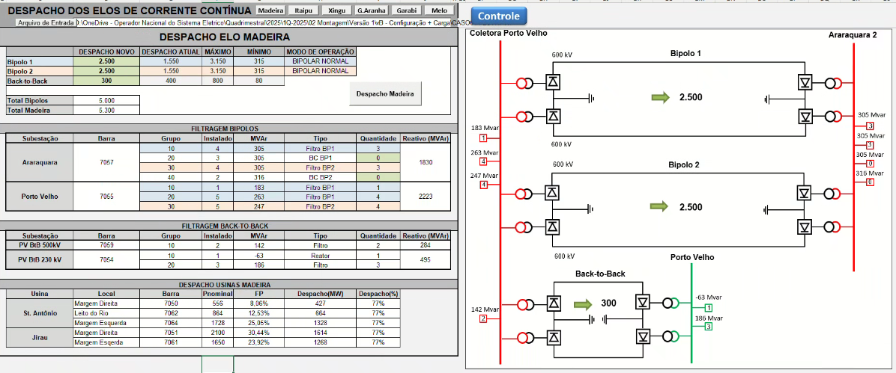

# 🦇 BatCaverna PV - Centro de Comando 2026

📅 Data: **16/04/2026**


## 📑 ÍNDICE RÁPIDO

### ⚡ **TRABALHO - ONS PLC 2026**

- 📋 [Tarefas ONS PLC](#tarefas-ons-plc-2026)

### 🎯 **PROJETOS GITHUB**

- [Projetos GitHub](#projetos-github)

### 🎯 **DESENVOLVIMENTO PESSOAL**

- 📚 [Sessão de ESTUDOS](#sessao-de-estudos-matematica-programacao-e-eng-eletrica)

### 📅 **PLANEJAMENTO SEMANAL**

- 📋 [Checklist Diário](#checklist-diario)

### 🎯 **LINKS WEBSITES**

- <https://www.mat.ufmg.br/futebol/classificacao-para-libertadores_seriea/>
- <https://gohan-treinamentos-web-app-one.vercel.app/home>
- <https://electrical-system-simulator.vercel.app/>

### 🔧 **OUTRAS SEÇÕES**

- 📊 [Roadmap Cientista de Dados](#roadmap-cientista-de-dados)
- ⚡ [Conceitos Fundamentais de Eng. Elétrica](#sessao-de-estudos-matematica-programacao-e-eng-eletrica)

---

## 🎓 Roadmap Cientista de Dados

<a id="roadmap-cientista-de-dados"></a>


### ⚡ Alinhamento do Dia — Execução com Precisão


---

## 🔮 Alinhamento Espiritual

### 🟦 Chakra do dia: 

- Seg:Coronario
- Terça: Garganta (Vishuddha)
- Quarta: Cardiaco
- Quinta: 3rd eye
- Sexta: Solar Chakra
- Sabado: Root Chackra


- Comunicação, clareza e verdade
- [ ] Falar menos e com precisão
- [ ] Ser direto no código e nos estudos

---


### ✝️ Leitura do Evangelho e Cartas espirituais

- Mateus 7:7
- Salmo 23


---

### ✨ Mensagem do Dia

- [ ] 

---

### 🔥 Dom do Espírito Santo: 

- [ ] Aplicar conhecimento na prática

---

### 🧠 Filosofia Japonesa: Ganbaru, Ikigai, Banho de floresta

- [ ] Persistir mesmo sem motivação

---

### 💬 Frase de Poder

- Cartões de enfrentamento 
- Afirmações positivas
- Meditação e pensamento consciente
- [ ] Repetir 3x ao longo do dia

---


# 🏆 Vitória do Dia: ESTUDOS

- [ ] Manter consistência mesmo com dia cheio


# ⚡ Equação do dia

### Lei de Kirchhoff das Correntes (KCL)

\[
\sum I = 0
\]

- [ ] Revisar conceito
- [ ] Aplicar em exercícios

---

# ⚙️ Planos e Metas do Dia (ONS + UFF)

🌅 Manhã (ONS 8h–10h)

- [ ] Foco total no trabalho
- [ ] Revisar KCL/KVL no intervalo (10–15 min)

---

🕛 Meio-dia (20–30 min)

- [ ] Resolver 3 exercícios
  - [ ] Lei de Ohm
  - [ ] KCL

---
🎓 Tarde (UFF)

- [ ] Assistir aula com foco no conceito principal
- [ ] Evitar perfeccionismo

🌙 Noite (60–90 min — BLOCO PRINCIPAL)

Tema: Análise Nodal

- [ ] Ver teoria (rápido)
- [ ] Resolver 3 exercícios
- [ ] Codar sistema linear simples

---

# 💻 Programação, Testes e Debug do Dia

- [ ] Implementar sistema linear:

```python
import numpy as np

G = np.array([[10, -5],
              [-5, 10]])

I = np.array([5, 0])

V = np.linalg.solve(G, I)
print(V)
```

# 🧪 QuizGame e Flashcards do Dia

- [ ] Resumo tecnico no quarto ou post no blog sobre o assunto que voce quer resolver e por isso precisa estudar
- [x] Resolver 3 questões do dia -> LKC, LKT e THEVENIn
- [ ] Entender os exercicios resolvidos dos livros

- [ ] 3 de Circuitos Elétricos
- [ ] 2 de revisão

## 💪 Corpo

Treino ou caminhada (20–30 min)

# 🧠 Dopamina Reset (Dia 14/04/26 - 21/05/2026)

- [ ] Sem pornografia
- [ ] Sem maconha
- [ ] Sem scroll infinito
- [ ] Controle de açúcar
- [ ] Recompensa só após missão

- [ ] Não quebrar a sequência
- [ ] Manter disciplina
- [ ] Executar o mínimo bem feito

## 🌙 Ritual de Encerramento do Dia

✔ O que avancei:

---

⚠️ O que ficou:

---

🎯 Amanhã (3 tarefas):

---

---

---

# Tarefas e Estudos Pendentes - Abril de 2026

- [ ] UFF 2026.1 -> Aulas e Quizz Games
- [ ] Circuitos CC x CA x CD x Sinais e Sistemas -> Python + Julia programming

- [ ] Eletromagnetismo: Resolver 3 exercícios de Lei de Gauss/Coulomb.

- [ ] Sinais e Sistemas: Revisar Transformada de Laplace (básico).

- [ ] Análise de contigencias com SN 45 com pandapower + Deckbuiler para o AnaREDE

- [ ] Matriz Ybus em Python para SEP

- [ ] Matriz admtancia + Geração x Transmissão e Distrbuição SIN pelo ONS
- [ ] Aulas Sinais/cricuitos CC/CA e Eng. Controle + SEP Fundamentals + Metodos numericos com Python

- [ ] Mincurso CC + arduino + python
  - [ ] <https://www.falstad.com/circuit/circuitjs.html>
  - [ ] Regra de Crammer
  - [ ] EDO sistemas 1 e 2 ordem com RLC e RC plots e respostas da EDO

- [ ] Metodos númericos em Matlab para engenharia usando Python (pelo livro de moetodos numericos)

- [ ] Solver ML/DL para cada X,Y de conjunto de dado

- [ ] Python com Sympy para calculo de EDO de 1 e 2 ordem para Circuitos CC (RL,RC e RLC)

---

# Batcaverna 2026

---

# PVRV 2026

---

- [x] Kanban, Scrum, Planejamento e metas (Segunda e sexta)
- [x] Organização de arquivos .MD
- [x] Organização projetos Github
- [x] Organização de Word e Excel usados para a semana no ONS
- [x] Pyside6 x Tauri x NextJS projetos

- [ ] Planejamento financeiro (Financial APP)
  - [x] Dezembro
  - [x] Janeiro
  - [ ] Fevereiro
  - [ ] Março
  - [ ] Projeção do grafico com derivdas
  - [ ] taxa de rendimento do salario ONS com 5% e 10% ao mes

- [ ] Planilhas Horarios + Planilha de controle financeiro
- [x] HTML templates para Gohan Treinamentos Refatorado com SOLID, MVC e framework CSS components

- [x] Juntar todos sites estaticos em HTML que tenho num unico projeto NextJS com rotas e MVC (Gohan Treinamentos, Legado PVRV, Pomodoro)

<a id="tarefas-ons-plc-2026"></a>

# Eng. Elétrica UFF 2025

- [ ] Processamento Digital de Sinais
- [x] Leitura Ogata - Teoria e pratica de Eng. de controle moderno
- [ ] Projeto Final de IoT com Arduino + MQTT + Python Rest API

# Projetos Github

- [x] Backend: Charizard (Drogon), Pikachu (Flask), Raichu (FastAPI)
- [x] Frontend: HTML, React, Flutter, Astro, Pyside6, Streamlit
- [x] Electrical-System-Simulator
- [x] meu-react-app-template (Gohan, Quizz, Habits)
- [x] my-flutter-getx-app (Kyogre, SCRUM, Todo)
- [ ] Simulações de Ciencia (Circuito RLC, Buraco Negro)
- [x] Gohan Treinamentos
- [x] Calistenia App + Goku IA trainer

# Sesão de ESTUDOS (Matemática, programação e Eng. Elétrica)

<a id="sessao-de-estudos-matematica-programacao-e-eng-eletrica"></a>

- [ ] Atividade ML de IEEEDs e principais modelo de AI de Supevisionado x Não Supervisionado (Com Rótulos x Sem Rótulos)
- [ ] Atividade IEEEDs = Esp32 + Senoides de corrente em series temporais para modelos de IA (como entrada de dados)
- [ ] Circuitos Digitais
- [ ] Circuitos eletricos CC
- [ ] Circuitos de corrente Alternada
- [ ] ENEM - Questoes de fisica e matematatica
- [ ] Circuitos trifasicos para SEP
- [ ] Eletromagnetismo
- [ ] Sinais e sistemas
- [ ]

---

# 📅 Rotina Checklist Diário \_\_TODO

<a id="checklist-diario"></a>

**Segunda-feira** - Setup, Planejamento, SCRUM & SEP

<<<<<<< Updated upstream
- [x] 08:00 - ONS (Home): Organizar backlog da semana.
- [x] 14:00 - Foco Técnico: Leitura sobre Load Flow (Fluxo de Carga).

**Terça-feira** - O Dia Longo

- [x] 06:25 - ONS (Presencial): Acompanhar operação do SIN com os colegas de trabalho.
- x ] 19:00 - Revisão leve de CC (Circuitos de Corrente Contínua).

**Quarta-feira** - Engenharia Elétrica e Hard Coding

- [x] 06:25 - ONS (Presencial).
- x ] 10:00 - Simulação: Tentar rodar um caso base e analisar os logs.
- x ] 15:00 - Estudos UFF (Biblioteca ou Casa).

**Quinta-feira** - Review & Code

- [x] 08:00 - ONS (Home): Documentar o que foi aprendido sobre SEP na semana.
- [x] 14:00 - Dev Time: Projeto Pessoal ou aprofundamento em SQL.

---

### 🚀 Projetos GitHub

<a id="projetos-github"></a>

- Verifique se o projeto `Github/Pikachu-Flask-Server` esta instalado na sua maquina local: <https://github.com/PedroVic12/Pikachu-Flask-Server>

- Batcaverna Project: GitHub\Pikachu-Flask-Server\batcaverna\batcaverna-project
- astro-system: \GitHub\Pikachu-Flask-Server\pikachu-API\astro-system
- quizz Show do milhao: GitHub\Pikachu-Flask-Server\frontend\Quizz_App_For_Studying_With_UI\quizz_show_do_mihao_AI.html
- Kanban PRO NextJS: GitHub\Pikachu-Flask-Server\frontend\project_kanban_pro_2025
- Pikachu Rest API:

- <https://github.com/PedroVic12/getx-for-qt6>

- <https://github.com/PedroVic12/Gohan-treinamentos-web-app>

---
=======
Projeto 1 - Pipeline de Exploração de Dados e Operações SQL com Spark SQL
Projeto 2 - Banco de Dados, Machine Learning e Pipeline ETL em Cluster Spark Para Detectar Anomalias em Transações Financeiras
Projeto 3 - Pipeline de Machine Learning em Cluster Spark Para Previsão de Churn - Treinamento e Deploy
 Projeto 4 - Pipeline de Pré-Processamento, Validação Cruzada e Otimização em Machine Learning
Projeto 5 - Otimização de Pipeline ETL e Machine Learning com PySpark
Projeto 6 - Pipeline de Coleta, Transformação e Modelagem Preditiva em Tempo Real com Spark Streaming e TensorFlow
Projeto 7 - Data Lakehouse Time Travel com Apache Spark e Delta Lake
Projeto 8 - Deploy e Inferência de Modelos de Machine Learning com MLflow e Databricks
- [ ] Planejamento de horários de aulas
- [ ] Livros:

---

# BATCAVERNA OLD 2025

---

# BatCaverna Editor:

Salve esses dados em:
https://github.com/PedroVic12/Pikachu-Flask-Server/tree/main/batcaverna


📅 Plano de Sprint: Terça-feira (Foco em Backend Python e SEP ONS)
Ciclo,Horário (50 min),Foco Integrado (Código/Teoria),Detalhamento da Tarefa (Passo a Passo)
1 (Backend),09:15 – 10:05,FLASK CRUD: Modelagem SQL,"Ação: No seu PikachuWebServer, defina a tabela Client (ou Task_Log) usando SQLAlchemy. Teste a criação da tabela no seu app.db."
2 (Backend),10:15 – 11:05,FLASK CRUD: Rotas API,Ação: Crie os endpoints POST /clients (Criação) e GET /clients (Leitura) na sua Blueprint user_bp.
3 (Teoria),11:15 – 12:05,MÓDULO 2: Matriz Y-Bus (Papel),Ação: TEORIA PURA (Stevenson): Finalizar a montagem da Matriz Y-Bus 3×3 em papel (as 2 Equações por dia que você se propôs).
Almoço,12:05 – 13:00,Rotina: Desligar a tela.,Ação: Seu descanso é sagrado.
4 (SEP/Código),13:00 – 13:50,MÓDULO 2: ybus_solver.py,Ação: Iniciar o código Python. Codificar a representação da Matriz Y-Bus 3×3 em NumPy com números complexos (transformar a teoria do papel em código).
5 (Alinhamento),14:00 – 14:50,DOCUMENTAÇÃO: IEDs/Aprendizado,Ação: Criar o novo arquivo .md (ex: ieds_log.md) e salvar a lógica de MQTT/LED/Buzzer que discutimos (o aprendizado de ontem). Isso limpa a sua mente e finaliza o IOT.

# Alinhamento PVRV - Novembro: ONS, UFF, Sáude mental e emocional - Corpo, Mente, Espirito

- MUST Software Desktop (Pyside6 + Access DB + modelagem SQL) - 11/11/25
- Palkia GUI + Console + Backend flask integrado com Dashboard HTML atividades SP
- Plugin Organon - Deck Builder + AnaREDE scripts + Fluxo de potencia Organon
- Flow despacho de cargas
- Flow Inequações
- Flow Elos CC
- Análise de contigencias PandaPower SIN 45
- Potencia Ativa x Reativa
- Equações P e Q e 7 principais
- Minicurso CC + Provas atingas circuitos 1 e 2 ordem EDO
- Estudos de Sistemas Elétricos de Potencia (SEP) (Fundamentos)
  - Potencia Ativa/ Reativa/ Aparente
  - Conceitos básicos de circuitos CA
  - Capacitores / Indxutores
  - Impedância, Indutância
  - Tap de transformadores na região de SP para controle de tensão
  - Equações principais para fluxo de potencia em diagrama unifilar
- Elementos do Eletromagnetismo
- Processamento digital de Sinais com Relés digitais e Series temporais de cargas de Substações

# Atividades MUST 28/10/25

- [X] Agrupação de paginas por tab no menu lateral
- [X] App Template Windows Desktop (Bloco de notas sobre)
- [X] Análise por empresa (query SQL)
- [X] Launcher (Palkia GUI) para script run.py rodando na mesma tela do dashboard_desktop_GUI.py
- [X] Conexão com SQLite e Microsoft Access
- [ ] Análise de dados usando Flow e anaREDE (Controle de casos, Usinas SIN, despacho, Inequacoões)
- [ ] QUAIS PONTOS SERÃO ANALISADOS, QUANTO O AGENTE ESTÁ PEDINDO, 	QUEM É O ID PROBLEMA ,	QUEM É O ID SOLUÇÃO
- [ ] Ajustar caminho relativo dentro do repositorio sem caminho Global do banco de dados
- [X] Deck Builder com Plugin do Organon - Testes de casos de uso SEP 16 barras, SEP 5 Barras, IEEE 14 e SIN 45
  - Fundamentação teorica: Barra Swing, Reator Shunt e Transformador em fase
  - Fluxo de potencia x Curto Circuito
  - Despacho de Cargas
- [ ] incluir no banco de dados de MUST a relação ponto de MUST x barras/circuitos do Fluxo de potência
- [ ] "régua" para inclusão de LTs e Trafos via script do Organon

# Lista de TAREFAS Pendentes __TODO

- [ ] Deploy: Plugin no Organon no notepad++ com scripts básicos de AnaREDE e Organon
- [X] App Template Pyside6 + SQL - MUST Controle e Gestão de Atividades com Chatbot AI com .EXE
- [X] Estudos CA para SEP usando GPT e Python
- [ ] Pyside6 com modelagem de dados (Sqlite3 + Microsoft Access) + Análise de Contigencias + Controle Atividades SP
- [ ] Automação Outlook + Teams + N8N = Relatorios automatizados por email e Whatsapp
- [X] Planejamento e Metas (Segunda/Sexta)
- [X] Análise de contigencias - Perdas Duplas
- [ ] MUST - Ponta e fora ponta ate 2030 com Controle e gestão de aprovação de documentos PDF com ou sem Ressalva.
- [X] Kanban/Cronograma -> Organização do cronograma de estudos
- [ ] Treino de calistenia e calistenia app
- [ ] Aulas Sinais/cricuitos CC/CA e Eng. Controle + SEP Fundamentals + Metodos numericos com Python
- [ ] Despacho de cargas - Planejamento Mensal e Semanal - Flow + AnaREDE, AnaTEM e Organon
- [ ] **Estudos SEP com base fundamental para CA**
- [ ] Chatbot Groundon, Lumina Aurora (Gemini) + Jarvis (GPT) + Copilot (copilot/cursor) with updates
- [ ] Corpo x Mente x Espirito -> Jobs, Coding, Studying, Creative, In Shape
- [X] Todos websistes unificados a Pikachu Flask API Server + github batcaverna
- [ ] Grondon Chabtot, Jarvis Chatbot, Lumina Aurora Chatbot
- [X] N8N x Node-Red + webhook + MQQT + Esp32
- [ ] Pyside6 - Eng. Controle com EDO e Equações de SEP
- [ ] Nextjs Website + MVP HTML templates (SEP do SIN da ONS para leigos)
- [ ] Controle  e Gestão Atividades SP + MUST --> Excel To Website and (.PDF + Access)to QT 6 Desktop Deck Builder Organon
- [ ] Must Desktop App Excel, Deck BUilder.
- [ ] Teoria de controle de engenharia moderno
- [ ] Proteção de SEP e monitoramento area SP
- [ ] Processamento de imagens de satélites com Python
- [ ] Bots e RPA com Python
- [ ] Estudos de IA, ML, DL, Chatbots, N8N, AI agentes frameworks (Agno/Langchain)
- [X] PROGRAMAÇÃO FRONTEND
- [ ] PROGRAMAÇÃO BACKEND

---

# LEGADO - ENG. ELÉTRICA - UFF, ONS, PIBIC, IoT Smart Grids

---

# Estágio ONS __IN_PROGRESS

- [X] Análise e Leitura do plano de Montagem de Quadros Mensal - dezembro com Organon, Flow e AnaREDE
- [ ]
- [ ] Dashboard MUST (Palkia GUI Desktop) ONS - Despacho + MUST PDF extractor ->  Banco de Dados com SQL/Access e relacionamentos com Dashboard final - Projeto Final rodando com .Exe usando banco de dados
- [X] Deploy: Plugin no Organon no notepad++ com .EXE
- [X] NextJS - SEP para Leigos Website
- [X] TAREFAS ONS
- [ ] Integração com Banco Access
- [ ] Automação de aprovações PDF
- [ ] Template Word + Geração automática
- [ ] Despacho de cargas (Flow, Anarede, Organon)
- [ ] Análise de contingências e relatório PDF
- [ ] Controle Casos 2025-2030 e dashboard atividades SP HTML com Excel Online
- [X] MUST Controle e Gestão - Desktop Software
- [X] Dashboard MUST (Palkia GUI)
- [ ] Simulações de SEP básicos do SIN (RJ/SP) no AnaREDE e Organon
- [ ] Análise de Contingências com PandaPower, AnaREDE e Organon (SEMANAL) -> Resultados em dashboard ou PDF
- [ ] Langchain Agent - Asimov
- [ ] 2 dashboards Streamlit - Asimov
- [ ] Chatbot Streamlit com PDF da ONS (Bot Oráculo)
- [ ] Estudo VSC e LCC em redes HVDC
- [ ] Micro e Minigeração Distribuída (MGD)
- [X] Relatório + Reunião Semanal
- [ ] **Upgrades** e Levantametno de requisitos MUST Dashboard GUI Desktop (Controle e Gestão atividades SP)

  - [ ] Controle atividades SP e RJ com planilha 2025
  - [ ] Limpeza de dados do Excel para utilizar os dados de SP 2025 e 2024 _inicio 22-10-25_
  - [ ] Criação do Sistema do Pyside6 para gestão de MUST, aprovação com ou sem ressalva e geração do Deck da solicitação
  - [ ] Criação de word template para entrega de documentos
- [ ] SIMULAÇÕES, ESTUDOS, ANALISE DE DADOS E MODELAGEM DE SEP com ASP (Organon, AnaREDE e PandaPower)

  - Curto circuito e onda de alta frequencia entre os ramos
  - Transformador em Fase
  - Reator Shunt
  - Barra Swing
  - Inequação de SEP
  - Tap em Transformador (muda o angulo)
  - Elos CC
  - Despacho de cargas com Flow
  - Fluxo de potencia / Fluxo de potencia Otimo
  - Estabilidade
  - Estudos de Máxima e minima Diurna
  - Inercia de SEP
- [ ] Controle de Casos 2030 - PLanilha Flow despacho (SEMANAL) + DASHBOARD usinas GEO BR
- [ ] Montagem de decks para caso 8 - VD e VE (AnaTEM)
- [ ] Controle de Casos Quadrimestre - 2026 - 2030 (MENSAL)

  - Montagem de decks de cargas inicial (leve, médio e pesada)
  - Caso de uso de fluxo de potencia convergente com ORGANON
  - Metas 1Q 2025 - > Pegar um caso (Ex: Caso 8 -> Abril máximo Noturno)

  - [ ] Usar na planilha flow as TABELAS DE gerações de cargas das usinas Belo Monte + pimental, Completo teles pires, Itaipu, GER madeira, Tucuruí. (CASO 8)

    - Gerar os decks dos casos análisado no Anarede verificando a barra Swing
    - Estudos de caso: Usinas X Despacho de Cargas x Dipolos (Uso de AnaREDE)
  - [ ] Usar o caso 8 para aba de ELOS CC

    - Back to back: Transformador -> Circuito CA -> Conversor CC -> Circuito CA: Objetivo: Transformar um transformador de 200KV para 130kv (exemplo), onde entre o ELO CC as pertubações sao diferentes de cada lado
      
  - [ ] Simulação Deck completo de caso selecionad ano anaRede pare fluxo de potencia Convergente.
  - [ ] Correção VD - Caso 8 -> Convergente e passagem de decks correto com script em python. Validar com Caso 10 -> Bruninho corrigiu com novos decks convergentes
  - [ ] Montagem VE - AnaTEM ->

# Eng. Elétrica UFF 2025 __IN_PROGRESS

- [ ] Modelagem do Fluxo de Potencia - prof luciano
- [ ] SEP e Análise de Sistemas de Potência (ASP/Stevenson)
- [X] Estudos CA e Fluxo de Potência / Curto Circuito no PandaPower, AnaREDE, Organon.
- [ ] Estudos de ASP com Python
- [ ] Estudar o que são VSC e LCC em Redes Eletricas para o SIN (google)
- [ ] Estudar o que é MGD para Rede Elétrica (Micro e Minigeração Distribuida) (google)

- Eletromagnetismo / Circuitos CC/CA (Sadiku)

- [ ] Modelagem de Circuitos Elétricos com Laplace ou Resposta completa da EDO usando casos de uso RLC e RC e usando análise Nodal e Malhas para CC e CA
- [ ] Caso de Uso Sympy - para resolver integral e derivada e fazer calculo na mão.
- [ ] Lei de Coulomb, Lei de Gauss, Eq. Laplace/Poisson, Lei de Ampare, Lei de Faraday
- [ ] Circuitos RL e RLC (1ª e 2ª ordem)
- [ ] Resposta completa em regime transitório
- [ ] Cálculo nodal e malhas em CA
- [ ] Provas antigas + simulações Python
- [ ] Vetor de Poyting
- [ ] Fasores
- [ ] 4 Equações de Maxwell
- [ ] Análise de circuitos elétricos 2 - Segurança operacional ONS - Fluxo de Potencia, Barra Swing, Reator Shunt e Transformador em Fase

- Eng. Controle Moderno e Sinais e sistemas (Ogata e Oppehhaim)

- [ ] Sinais e Sistemas - Transformada de Laplace
- [ ] Leitura de capítulos 6-13 Eng. de Controle Moderno (Ogata)
- [ ] Projeto PID com Python e PyQt
- [ ] Processamento Digital de Sinais
- [ ] Leitura Orante do livo Teoria e controle moderno nos capitulos principais como: Cap 6,7,8 e 9 (metodos old - Lugar das Raízes e Resposta em Frequencia) e cap 11 e 13 (moderno com váriavaveis de estado)
- [ ] Estudar conteúdo de Sinais e Sistemas e Circuitos Digitais passando a limpo as anotações

- IoT e IEEDS (automação industrial)

- [ ] Projeto Final de IoT com Arduino + MQTT + Python Rest API + WebServer em C++ com Tela em index.html com análise de dados de séries temporais de Sensores de Luz, LDR e acionamento de LEDS e Buzzer.
- [ ] Circuito Contador JK com arduino
- [ ] IOT E ARDUINO COM WEBSOCKET COM HTML ANALISANDO SERIES TEMPORAIS

- UFF, Estudos Acadêmicos e Provas Antigas

- [X] Mátematica aplicada a Eng. Elétrica, ONS, Ciencia de Dados / ML, Provas Antigas
- [X] Estudos UFF com modelagem e prototipação/simulação de circuitos digitais e eletricos CC/CA com arduino e esp32. Eletronica para makers
- [ ] Minicurso CC + CD
- [ ] Minicurso Matemática básica ENEM - Geometria Espacial, Logaritmos e Questões matemáticas de ITA e IME
- [ ] Jedi Cyberpunk - Python com Métodos Numéricos + Otimização e uso de Redes Neurais (pegar exemplos de eng dos códigos de matlab)
- [ ] AstroML - Machine learning
- [X] 1 cap. de um livro de matemática e física por dia
- [ ] 2 Equações do dia

---

# ROTINA

---

# VIDA PESSOAL E ROTINA __IN_PROGRESS

- Corpo, Mente (Treino, Calistenia, Saúde) e Espirito (Alinhamento, Chakras, Meditação)

- [ ] Treino de calistenia
- [ ] Alongamento diário
- [X] Alimentação 4x/dia

## Espiritualidade

- [X] Alinhamento diário (chakra + salmo + equação do dia)
- [ ] Meditação e leitura bíblica
- [X] Diário de evolução espiritual

## Hábitos, Organização e PLanejamento

- [ ] Fechar 10 abas
- [ ] Limpeza semanal do apartamento
- [ ] Planejamento seg/sex + Kanban pessoal
- [X] Terapia
- [X] Alongamento + Calistenia + Rotina de treinos com saúde em boa forma
- [ ] Meditação e alinhamento espiritual
- [ ] Treino gym
- [X] Fechar 10 abas
- [X] Limpeza no apartametno (seg/sex)
- [X] Lavar a louça e passar pano na casa
- [ ] Limpeza de banheiro de cozinha
- [X] 4 Refeições por dia (Café da manha, Almoço, Lanche (pré-treino) e Jantar)
- [ ]
- [X] Jogos

  - The Witcher 3
  - Bully - ps3 / GTA 4
  - LOL ou Warzone
  - Jurassic Park Evolution
  - Pokemon GBA ou NDS

# TDAH - Rotina (Saúde, Paz e Equilibrio) __IN_PROGRESS

- [X] Visualização KANBAN e gerar 5 tarefas do dia (MANHA)
- [ ] Organização mental e preparação para novo Ciclo JEDI CYBERPUNK com resolução de provas, tutorial de 10 min de programação, modelagem e simulações de eng eletrica junto com automações com N8N
- [X] Alinhamento Espiritual

  - [ ] Segunda - Chakra: Solar
  - [X] Terça - Chakra: Garganta
  - [X] Quarta - Chakra: Cardiaco
  - [ ] Quinta: Chakra: 3º Olho
  - [X] Sexta: Chakra: Root
- [ ] You Only Need 5 Hobbies (Money, Study, Mindset, In Shape, Creative)
- [ ] Meditação e estudos com Matemática e Japonês
- [X] Alongamento matinal - Ombros e Quadril
- [ ] Treino de calistenia para karate
- [ ] 2 equações do dia
- [ ] 2 projetos no dia (backend/frontend)

---

# PROGRAMAÇÂO

---

# Programação FullStack  (Github) __BACKLOG

- Frontend (HTML/CSS/JS, React, NextJS, Flutter, Astro)

- [ ] Astro blog pedrov12
- [X] Blog SEP para Leigos NextJS
- [X] Websites HTML + Flask Pikachu API
- [X] React Components e Dashboard ONS
- [ ] Flutter Apps (Calistenia App, App Financeiro, Gohan Treinamentos)
- [X] DASHBOARD + PalkiaGUI - MUST - ONS (Controle e Gestão Atividades SP e MUST)
- [X] Frontend: HTML + JS, React, Flutter, Astro, Pyside6, Streamlit

- Backend (FastAPI, Flask, Django, Tornado, SQL, NodeJS, N8N, Drogon C++)

- [ ] FastAPI Auth + CRUD Supabase
- [X] Flask API - Pikachu Server
- [ ] Django Ninja / Tornado Server
- [ ] Backend: Charizard (Drogon), Pikachu (Flask), Raichu ( FastAPI), Dragonite (Tornado)

- Desktop (PySide6, QT Designer, Access Microsoft DB, SQL)

- [ ] Pyside6 - Eng. Controle + Deck Builder
- [ ] Qt MVC + SQLAlchemy + Access Integration

- IA e Agentes (Chatbots, N8N, ML, DL, Langchain)

- [ ] Jarvis GPT + Lumina Aurora + Groundon
- [ ] Langchain + Agno + Streamlit Oráculo
- [ ] ML com dados ONS e Kaggle

- Modelos de Machine Learning x Deep Learning
- Dashbaords (HTML/React, Streamlit)
- IoT e Automação

- [X] Node-RED + N8N + MQTT
- [ ] ESP32 com API Python
- [ ] Dashboard IoT em HTML/Flask
- [ ] Eletronica para Makers

- Algoritimos de Otimização + Métodos Numéricos + Modelagem Matemática

- [X] Electrical-System-Simulator
- [ ] meu-react-app-template (Gohan-Treinamentos, Quizz App, Habits tracker - Iconic)
- [ ] my-flutter-getx-app (Kyogre App, SCRUM Planner App, TodoList App, Controle Financeiro App, Controle Estoque App)
- [ ] Planilha e Controle financeiro Flutter
- [ ] Pikachu-Flask-Server
- [ ] Raichu-django-Server (Charizard Drogon C++)
- [ ] Raichu-Server (FastAPI / Tornado)
- [ ] Rayquaza Web Server (FastAPI)
- [ ] RCE - AG DEAP + Streamlit | Simulator de Redes Elétricas PandaPower + PySide6
- [ ] Simulações de Ciencia (Circuito RLC, Buraco Negro, Orbitas da Terra)
- [ ] sistemas-web-template
- [ ] virtual-shop-Modas Veras
- [ ] Gohan Treinamentos
- [ ] Calistenia App + Goku IA trainer
- [ ] Gohan Treinamentos + Hobby XP PSI + Calistenia APP + Controle Financeiro + Dashboard com Flutter Getx e Vaden
- [ ] WebSites e sistemas web em Astro/NextJS
- [ ] Backend com Flask, FastAPI, Django, Ninja, Websockets, Supabase + Redis + SQL
- [ ] Boas práticas com SQLAlchemy e Python e Pyside6 - MVC desktop Apps com C++ Dragon Web Server

# Projetos Portfolio/SAAS (React + Python + SQL) __BACKLOG

- Projetos Pessoais e Portfólio

- [ ] Estudos de frontend com Astro/React, Flutter e MVP em HTML + Bootstrap
- [ ] Data Driven com metodos SCRUM com organização e planner de projetos PVRV como freelancer e suas tecnologias

- ONS, Pesquisa Científica e Cientista de dados

- [ ] Projetos Visão Computacional
  - Contador de embaixadinhas
  - Contador de rolinhas (webcam)
  - Calistenia App
  - Analise de futebol com tic tac toe com projetor e bola na parede
- [ ] Projeto Visão computacional com cancer de mamas + Contador de embaixadinhass
- [ ] IOT E ARDUINO COM WEBSOCKET COM HTML ANALISANDO SERIES TEMPORAIS
- [ ] CIENTISTA DE DADOS - ML E DATASET ENERGY + CLASSIFICATION + REGRESSION + KMEANS

- Freelancer / Negócios / Monetização

- [ ] API REST com Django ninja, FastAPI, Flask, Tornado, Drogon C++
- [ ] Sistemas de CRUD  (Cadastro de Clientes) e api usando python com Flask/FastAPI com docker e boas práticas de modelagem de banco de dados

- Projetos com Datasets de orgãos publicos

- [ ] Dashboard analise distribuição energético ONS + SIN - Website para leigos
- [ ] dados publicos gov br
- [ ] Dados ONS
- [ ] Dados Kaggle
- [ ] Dados imagens de Satélites

---

>>>>>>> Stashed changes
