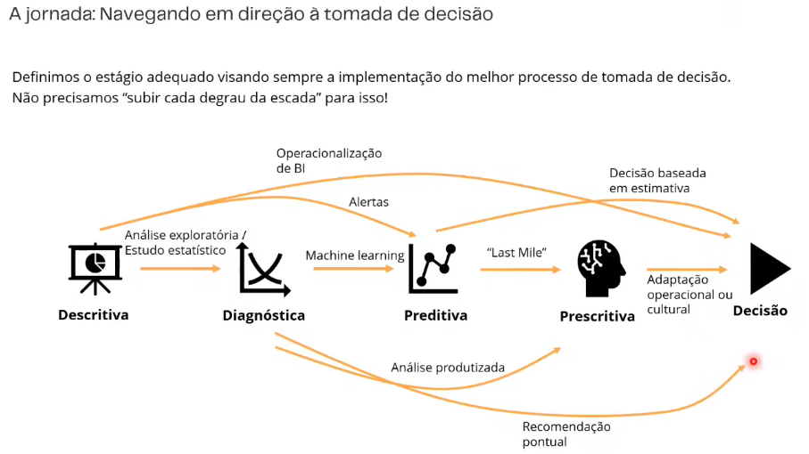

## 🦇 BatCaverna PV - Centro de Comando 2026

---

📅 Data: *02/09/2026** - *Quarta Feira*

Rotina Semanal:

*Segunda Feira* = Root Chakra + Academia
*Terça Feira* = Throat Chakra + Circuitos CC e CD + Terapia
*Quarta Feira* = Heart Chakra + Homeoffice + Artigo TCC
*Quinta Feira* = Third Eye Chakra + Circuitos CC e CD + Karate
*Sexta Feira* = Solar Chakra + Dia de Oxalá
*Sabado* = Folga + Rotina + Futebol + Jogos
*Domingo* = Dia de Missa e Familia

---

# ⚡📑 01) ÍNDICE

# 02) **JOBS**

### Trabalho Cientista de dados JR no ELITE Rede de Ensino

### Trabalho 2023-2024: Estagio: Camorim Serviços Marítimos de Engenharia Elétrica

### Estagio de Engenharia Elétrica: ONS PLC (Planejamento de Curto prazo) e análises de Estudos Elétricos em Regime Permanente (estático) para área de SP de 135KV, 345KV e 440 KV

### Cientista de dados JR (Python, Julia, Javascript)

## 🎓 Roadmap Cientista de Dados

### Desenvolvedor Desktop IoT - PQt6 + Tauri V2 (rust) + Banco de dados

### Desenvolvedor web

- Pikachu Flask Server
- Rayquaza Web Server - FastAPI
- Kyogre PDV Delivery app
- Gohan Treinamentos app

- 📋 [Tarefas ONS PLC](#tarefas-ons-plc-2026)

### 🎯 **PROJETOS GITHUB**

- [Projetos GitHub](#projetos-github)

# JOBS 2026

- [ ] Trabalho PJ como DEV R$ 5000 ou U$ 1500 - Como Assistente de Análise de Dados ou dev pleno com Python,C++ ou Javascript
- [ ] Pesquisa e Desenvolimento UFF + IA + SEP e Simulações em 3D
  - SEP para leigos
  - AnaREDE x Organon x Pandapower(RCE)
  - Otimização linear com AG ou metaheuristicas (Análise de Dados)
  - Astropy x Sympy x Scipy
  - Resumo minicurso: Astronomia como Soberania Nacional

- [ ] Vaga PJ R$ 5000 reais para Analista de dados JR com python,  vba,julia e javascipt
- [ ] Freelancer SEO com google meu negocio usando webistes vitrine com alcance de clicks dos usuários

## 🎯 Checklist Top 3 Diário (Execução do Dia)

- [ ] **Item 1 (UFF)**: Executar os blocos de código do notebook [Circuitos_Digitais_Contadores_FF_JK_P2.ipynb](file:///home/pedrov12/Documentos/GitHub/Jedi-CyberPunk/PVRV/SPRINT%20ATUAL/UFF/Circuitos_Digitais_Contadores_FF_JK_P2.ipynb).
- [ ] **Item 2 (Cálculo & Física)**: Resolver 3 problemas de circuitos e espaço de estados no caderno digital Xournal++.
- [ ] **Item 3 (PySide6)**: Carregar uma planilha real no Dashboard PySide6 para validar o filtro de colunas e o Toast Notification:

# 03) MENTE - Estudos UFF 2026.2 + artigo tcc + astro blog

### 🎯 **DESENVOLVIMENTO PESSOAL**

### Estudos SEP E ONS

- 📚 [Sessão de ESTUDOS](#sessao-de-estudos-matematica-programacao-e-eng-eletrica)

### TERAPIA TCC

# 04) CORPO - Academia + Calistenia + karate

## ESPÍRITO - Casa de Deus: Cristão Católico + O Livro dos Espíritos

---

# 05) Batcaverna 2026

---

💡 Dicas práticas

  > Execute em ciclos curtos: rodar script → validar → corrigir → repetir

---

# KANBAN + SCRUM + Organização + Planejamento + metodologia ágil

Aguardando envio

Pendências | importante

Concluído

- Entregas ageis
- Kanban para divisão de tarefas BACKLOG, IN PROGRESS, TESTING e CONCLUIDO

### Gerenciamento do tempo

- Pomodoros: 50/10
- Divisão de tarefas em atividades gerenciais

### Gerenciamento de Prioridades

- Matriz Eiseingher: Urgente e Não urgente
- Eat the frog first
- Prioridade de 3 tarefas principais do dia

### Planejamento e Metas

- Planner otimizado com rotinas automatizadas toda segunda e sexta
- Tarefas com entrega com datas claras e acompanhmento do processo em tempo real

---

🧠 Diário de Bordo

Bloqueios?

Questões emocionais

Falta de rotina x Organização e Planejamento

Abstinencia de maconha de 4 dias. Fumei domingo e segunda para aliviar, mas me deu sono e apenas tesão

Falta de foco e clareza no que seguir nos estudos: Ciência de Dados e Eng. Elétrica

Falta de segurança em mim mesmo

---

# 06) Atividades UFF

- [ ] minicurso circuitos CC com Sadiku e Python

- [x] Circuitos Digitais I
  - [x] P1: Codigo de hamming, sistemas de numeracação, teoremas booleanos, circuitos logicos combinacionais, mapa de Karnaugh
  
- [ ] Circuitos Elétricos CC
  - [x] P1
    - 5 Provas antigas
    - LKC, LKT, Divisor de tensão, divisor de corrent, Potencia em resistores, amplificadores

  - [ ] Minicurso CC - Falstad e Python/Julia
  - [ ] P2
  - [ ] P3
  
- [x] Robotica para Iniciantes
  - Conceitos basicos Arduino e programacao em C++
  - Sensor ultrassonico
  - Motores e Drivers
  - Sensor de reflatancia

- [ ] Guia de Montagem Mensal Word x Anotações Obsidian (VA,VB e SEMENTE)

- [ ] Diagrama SP - Organon 440KV
- [ ] Conversas com Alexandre Nunes e João Marco

- [x] Guia de Montagem de Decks: Mensal (Word + Obsidian)

- [ ] Guia completo em Word e PDF dos processos de atividades do mensal usando simuladores CEPEL e FLOW

  - VA = Decks de Configuração e Carga para casos SEMENTE
    - Correção barras ausentes
    - Planilha SISBAR: Parecer da Área (fix_decks_barras_ausentes.py) = Retorna uma planilha atualizada comparando as barras ausentes do Mes atual e mes anterior utilizando as Respostas PLC no caso correspondente para região SECO
    - Decks Eletrico/PRD: Script para comentar barras ausentes nos casos (ler_decks_de_carga.py)
  - VB = Redespacho de Usinas na FLOW usando politica energética + Case Manager no Organon para Fluxo de Potencia Ótimo.
  - VC = Intercambios
  - VD = FLUPOT
  - VF = Ajustes finos de tensão e carga para SECO
  - VG = AnaTEM
  - VH = Emissão do Relatórios

- [x] Relatório de Perdas Duplas LTs usando VBA e Plots de 3 gráficos

---

# Tarefas e Estudos Pendentes

- [ ] Circuitos Elétricos CA
- [ ] Eletromagnetismo I - Campos estáticos
- [ ] Sistemas de controle I, II e III
- [ ] Análise de SEP I, II
  - Teorema de Norton e Thevenin
  - Máx de transf. de potência
  - Fluxo de potência
  - Curto circuito
  - Barra Swing

- [ ] IEEDs
- [ ] Sistema de computação

---

# Estudos UFF 2026.2

- [x] Python e Julia para Astronomia

- [x] Cálculo 1,2,3 e 4 (Até EDOs e Transformada de Laplace - RLC)
- [x] Estatística I
- [x] Estatística II
- [x] Transmissão de calor I
- [x] Fenomemos de transporte (Mecanica dos fluidos)
- [x] Controle e qualidade - Administração (Metodos estatísticos)

- [ ] Sinais e Sistemas
- [x] Cálculo 2 e 3 (cálculo vetorial)
- [x] Calculo Vetorial com Metodos Numéricos em Julia usando apenas Cálculo 1 e Plots no youtube

- [x] Programação para Data Science (Julia, Plots.jl, Pandas, Plotly, Scipy, sympy)

---

# Rotinas de Dono de Casa (Homem TDAH Adulto)

- Melhores a cada dia
- respeito
- Disciplina e Responsabilidaed

- [ ] Tomar banho
- [ ] Vestir roupas limpas
- [ ] Lavar o Rosto e fazer Skin Care
- [ ] Exercicio Físicos
- [ ] Alongamento de Quadril, Ombra, Colunas e Core
- [x] Limpeza arpatamento
- [ ] Alinhamento Espiritual matinal
- [ ] Banho Gelado - Detox de Dopamina (Banheira de gelo)

---

# Jogos

- [x] FIFA 19 - Modo Carreira 19 e 26
- [x] COD Black OPS 1 - Guerra Fria
- [x] COD Black OPS 2 - 2025 Guerra moderna
- [x] SMITE 2 ou League of Legends Classic ou Dota 2
- [x] The witcher 3
- [x] Pokemon Radical RED
- [x] FIFA 14:
  - <https://www.reddit.com/r/FifaCareers/comments/1rjnorf/how_to_download_fifa_14_on_pc_for_free/?tl=pt-br>
  - <https://drive.google.com/file/d/1c8R35D2lMrK827zOIjWrMJ1jP2j0ipgZ/view>

# 07) Corpo x Mente X Espírito = Equilíbrio

## Mundo espiritual

- alinhamento espíritual do dia
- rotina de evangelho do dia e salmos
- leitura de Gênesis, Evangelho, Profetas e Profecias, Atos dos apóstolos, Apocalipse

- periodos do calendário católico

- santo terço e Detox de pensamento ruins e diminuição de ansiedade

- Curso Raízes de Aruanda e postagem no blog

- previsão março de 2026 - hudd (conversar com o bruxo)

- previsão maio e junho de 2026 - hudd

- 2 missões espirituais em 60 dias
- "ensinar a fazer certa pessoa próxima a encontrar seus talentos no meio de trabalho"

- "minha mente funciona de forma diferente, eu vim para incomodar. Estou aqui para questionar e demonstrar matemática e cientificamente falando assuntos que instiguem na evolução da raça humana."

 programação, engenharia elétrica, ética

- estado de espírito

- Aura, Espírito e Mente

- Campo energético vibracional do ser humano (potencial do campo elétrico do cérebro)

- sessões de confissões de pecados com terço da misericórdia com exame de consciência

---

# 08) PVRV 2026 Notes

---

# 09) Terapia TCC 2025-2026

- Fim de relacionamento Danielle

- Desregulação emocional por TDAH e com ma alimentação e falta de treinos

- TCC com cartões de enfrentamento com mudanças de hábitos e tarefas com uso de Atentah e Venvanse em gotas

- Estudos UFF X Coding X JOBS x Treinos X PVRV (jedi cyberpunk)

- Desapego e dependência emocional

- Uso compulsivos de substâncias dopaminergerticas (uso de telas, maconha, masturbação)

- Auto estima, autocríticas, autoconfiança e síndrome do impostor

- timidez e crenças limitantes por traumas infantis

- Soft Skills para UFF e ONS

- Sobrecarga de tarefas com cartões de enfrentamento e ferramentas de produtividade para gerenciamento de tempo e tomadas de decisões baseado em dados

- Início de relacionamento Viviane

- a saúde mental x espiritual na prática

---

# 10) SCRUM Planejamento e organização PVRV

- [ ] Planejamento financeiro (Financial APP)
  - [x] Dezembro
  - [x] Janeiro
  - [ ] Fevereiro
  - [ ] Março
  - [ ] Projeção do grafico com derivdas
  - [ ] taxa de rendimento do salario ONS com 5% e 10% ao mes

- [ ] Planilhas Horarios + Planilha de controle financeiro + Planilhas de treinos

- [x] planilha de contas a pagar do aluguel em Niterói

- [ ] passar a limpo screenshots e anotações do caderno para os blogs

- [ ] requisitos, responsabilidades e atividades na PLC ONS como guia no Word ou Obsidian

- [ ] Conta de luz com plots em Julia e Python e otimização com derivada de conta de luz

- [ ] 3 orçamentos gratis com empresas de energia solar para casa em CG

- [ ] Planejamento Financeiro, trabalho PJ e MEI

---

# Estudos UFF 2026.2

- [ ] Aulas de robotica com Arduino (Carrinho lutador)
  - [x] Fase 1
  - [ ] Fase 2
  - Programação em C++ e RPA com Python e Shell Script com conexões API com flask e FastAPI

- [ ] Circuitos Elétricos CC
- [x] Cálculo 1,2,3 e 4 (Até EDOs e Transformada de Laplace - RLC)
- [x] Estatística I
- [x] Estatística II
- [x] Transmissão de calor I
- [x] Fenomemos de transporte (Mecanica dos fluidos)

- [ ] FastAPI x Flask x Django x Drogon C++ x Nodejs(express) - projetos backend

- [ ] Estudos de Somatorios, Funções de
 Potencias, Circuitos Eletricos CC e Circuitos Digitais

- [ ] Matriz admtancia + Geração x Transmissão e Distrbuição SIN pelo ONS

- [ ] Metodos númericos em Matlab para engenharia usando Python (pelo livro de moetodos numericos)

- [ ] Solver ML/DL para cada X,Y de conjunto de dado

- [ ] Python com Sympy para calculo de EDO de 1 e 2 ordem para Circuitos CC (RL,RC e RLC)

# ⚡ Bloco de Estudos Circuitos Digitais + Nivelamento ONS PLC

## Estudos UFF 2026.1

- [x] Circuitos Digitais P1 (Karnaugh, SOP, teoremas booleanos)
- [x] ONS (Python + relatórios + checklist)
- [x] Projetos (calculadora + Organon + Pyside6)

- [x] P2 circuitos digitais
- [ ] Provas P2 e P3 de circuitos eletricos CC
- [ ] Provas de Sinais e Sistemas e Eletromagnetismo

- [ ] Provas do ENEM: matematica e Fisica no youtube

- [ ] Minicurso: Calculo Numero com Python e Julia

- [ ] Resolver sistema de solver de calculadora de EDO e Matrizes com plots em Qt6(sympy)
- [x] Plot função (matplotlib)
- [x] Integrar no PySide6

---

---

# Estudos Elétricos do ONS para SEP

- Transformador em Fase
- Geradores, Reatores e Transformadores com suas linhas de transmissão. 3 bus, 5 bus, 7 bus...
- Barra swing
- Reator Shunt
- Barras PQ E PV
- Transformador em Fase
- Ferramentas FLOW 9.0
- anaRede x Organon x Pandapower
- Casos Máxima e Mínima (Noturna e Diurna)
- Inércia do sistema
- análise de circuitos RLC com impedância e reatância (capacitiva ou reativa)
- Potência Ativa x Reativa
- fluxo de potência e Curto circuito

- Transmissão X Geração X Distribuição
- RCE: Agendamento ótimo de análise de contingências para intervenções no Sistema Elétrico
-

---

---

# Concluidos 2026

- [x] HTML templates para Gohan Treinamentos Refatorado com SOLID, MVC e framework CSS components

- [x] Juntar todos sites estaticos em HTML que tenho num unico projeto NextJS com rotas e MVC (Gohan Treinamentos, Legado PVRV, Pomodoro)
- [x] Kanban, Scrum, Planejamento e metas (Segunda e sexta)
- [x] Organização de arquivos .MD
- [x] Organização projetos Github
- [x] Update Diagrama Organon 440KV - Completo
- [x] Organização de Word e Excel usados para a semana no ONS
- [x] Pyside6 x Tauri x Flutter - projetos desktop
- [x] NextJS x Astro - projetos web
- [x] Organização e planejamento de Automaçôes ONS PLC 2026

---

### 🚀 Projetos GitHub

- Verifique se o projeto `Github/Pikachu-Flask-Server` esta instalado na sua maquina local: <https://github.com/PedroVic12/Pikachu-Flask-Server>

- Batcaverna Project: GitHub\Pikachu-Flask-Server\batcaverna\batcaverna-project
<https://batcaverna-pv.vercel.app/>

- astro-system: \GitHub\Pikachu-Flask-Server\pikachu-API\astro-system
- quizz Show do milhão: GitHub\Pikachu-Flask-Server\frontend\Quizz_App_For_Studying_With_UI\quizz_show_do_mihao_AI.html
- Kanban PRO NextJS: GitHub\Pikachu-Flask-Server\frontend\project_kanban_pro_2025

- <https://github.com/PedroVic12/getx-for-qt6>

- <https://github.com/PedroVic12/Gohan-treinamentos-web-app>

### 🎯 **LINKS WEBSITES**

- <https://batcaverna-pv.vercel.app/>

- <https://www.mat.ufmg.br/futebol/classificacao-para-libertadores_seriea/>
- <https://gohan-treinamentos-web-app-one.vercel.app/home>
- <https://electrical-system-simulator.vercel.app/>

- Pikachu Rest API:<https://pikachu-restapi.onrender.com/>
- World Monitor: <https://www.worldmonitor.app/>
- SAPECP: <https://sintegre.ons.org.br/sites/SAPECP/Paginas/VisibilidadeCiclos.aspx>

---
