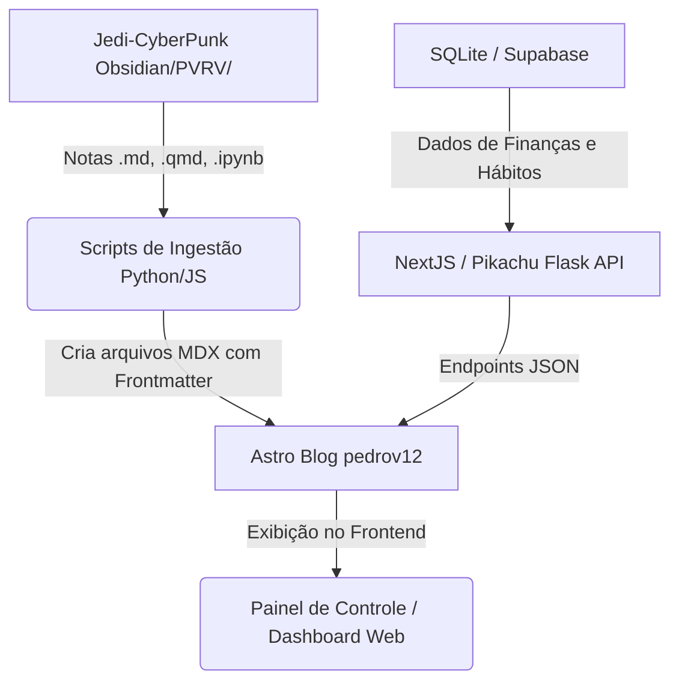

---

# Google Gemini Pro - Flutter e React components with MUI3

---


---

# Antigratity CLI 2


---

prompt de acesso aos arquivos

"estou te dando acesso ao @[C3PO-Assistente-Virtual-BR] e pode criar tudo nele smepre que eu falar com voce
  para ter suas proprias ferramentas de shell script e scripts pyuthonm que pode ir criando para voce. bom, nao
  sei ate o que vc sabe sobre mim e se ja sabe m pesuisasr no github ou linkenin ams quero em aprenstar e vou
  tpeorxiar da sua ajuda na minha jornada espirtuial chamda de vida humana ate a vida etertna como disse jeus
  trabalhadno conm rpogramcao e sistemas eltricos de potecnia, assim como temrinar meus estudos da UFF em eng
  eletrica; quero trabalhar com python, julia, c++, javascipt(nodejs e nextjs). quero o resumo de tudo que
  estamos falçando e vc me dizendo suas diretrizes e como posso gerencair minha mente como no @[Pikachu-Flask-
  Server/batcaverna/batcaverna-project] e criando esse site meio blog sobre como gerneciar minhas tarredfas,
  meu tempo de trabalho, emu tempo de ogrnizacao, meu app de controle fnacneiro, minha rotina de treinos, minah
  rotian de habtios e anotacoes em jupyter notebook e quarto .qmd de notas que eu faço com arquivo s.md para
  gencair proejtos, estudos e pesquias. eu ja fiz 2 artigos cientifocos de otimizacao de prog linear em python,
  quero ver qual repositorio tu acha que é esse"


---

# 🦇 Plano de Gestão da Batcaverna PVRV & Ecossistema de IA (2026)

Este documento é o plano diretor para gerenciar o ecossistema de produtividade, desenvolvimento e engenharia do **Pedro Victor (PVRV)**. Ele detalha a arquitetura mental e técnica para gerenciar o tempo, estudos de Engenharia Elétrica na **UFF**, tarefas do **ONS** e o pipeline de blogs científicos com **Quarto** e **Jupyter Notebooks**.

---

## 📈 1. Resumo da Conversa & Sua Jornada

A sua jornada une os campos fundamentais da **Engenharia Elétrica de Potência (SEP)**, da **Ciência de Dados (Machine Learning/Otimização)** e a busca por um propósito espiritual estruturado.

- **Linguagens e Stacks:** Python, Julia, C++, Javascript (NodeJS e NextJS).
- **Projetos Chave:**
  - **Trabalho ONS:** Automação e ETL de LTs, Agendamentos e Casos Mensais de Planejamento.
  - **Estudos UFF:** Conclusão do curso de Engenharia Elétrica.
  - **Produtividade/Mind-Control:** Interface unificada (Pikachu-API, C3PO, Batcaverna-CLI).

---

## 🔬 2. Identificação do Repositório de Artigos Científicos

O repositório que contém os seus dois artigos científicos sobre **otimização de programação linear em python** (especialmente voltado para agendamentos em redes elétricas via algoritmos genéticos/metaheurísticas) é o:
👉 **[Repopulation-With-Elite-Set](file:///home/pedrov12/Documentos/GitHub/Repopulation-With-Elite-Set)**

Dentro dele, os artigos e relatórios estão localizados em:
- [Controle de Versões/Artigos/Otimização de Agendamento Ótimo em Redes Elétricas - PIBIC 2025 - PVRV_21_10_25.pptx.pdf](file:///home/pedrov12/Documentos/GitHub/Repopulation-With-Elite-Set/Controle%20de%20Vers%C3%B5es/Artigos/Otimiza%C3%A7%C3%A3o%20de%20Agendamento%20%C3%93timo%20em%20Redes%20El%C3%A9tricas%20-%20PIBIC%202025%20-%20PVRV_21_10_25.pptx.pdf)
- [Controle de Versões/Artigos/relatorio_final_PIBIC_2025 - PVRV.pdf](file:///home/pedrov12/Documentos/GitHub/Repopulation-With-Elite-Set/Controle%20de%20Vers%C3%B5es/Artigos/relatorio_final_PIBIC_2025%20-%20PVRV.pdf)

---

## 🦇 3. Gestão Mental no `batcaverna-project`

O repositório **[Pikachu-Flask-Server/batcaverna/batcaverna-project](file:///home/pedrov12/Documentos/GitHub/Pikachu-Flask-Server/batcaverna/batcaverna-project)** serve como o launcher principal e painel de controle operacional do Linux.

- **[headers.py](file:///home/pedrov12/Documentos/GitHub/Pikachu-Flask-Server/batcaverna/batcaverna-project/headers.py):** Centraliza URLs, links para playlists de espiritualidade e caminhos das planilhas de monitoramento do ONS.
- **[linux_OS_SYSTEM.py](file:///home/pedrov12/Documentos/GitHub/Pikachu-Flask-Server/batcaverna/batcaverna-project/linux_OS_SYSTEM.py):** Executa o script de inicialização do sistema, medindo tarefas concluídas/pendentes, acionando áudio TTS e lançando navegadores/apps como Brave e Steam.

---

## 🌐 4. Design de Arquitetura: Site/Blog Unificado

Para integrar todas as suas frentes (tarefas, finanças, treinos, hábitos e artigos científicos em Quarto/Jupyter), propomos uma arquitetura baseada no **Astro** com suporte a **MDX** para interatividade:



### Funcionalidades do Dashboard Web

1. **Controle de Tarefas (Anti-Kanban):** Exibir um checklist simples de **3 metas diárias** carregadas a partir de arquivos Markdown na Batcaverna.
2. **Finanças:** Consumir os endpoints da sua API de finanças (projeto Flutter/GetX template) para renderizar gráficos de despesas e saldo mensal em componentes Plotly.js/React.
3. **Treinos e Hábitos:** Interface com mini-calendários dinâmicos exibindo os hábitos diários e calistenia.
4. **Artigos Científicos:** Exibir as renderizações do **Quarto (.qmd)** e **Jupyter (.ipynb)** processados de forma limpa como páginas HTML estáticas de alto desempenho no Astro.

---

## 🤖 5. Suas Ferramentas e Scripts do Agente em C3PO

Você deu acesso ao repositório **[C3PO-Assistente-Virtual-BR](file:///home/pedrov12/Documentos/GitHub/C3PO-Assistente-Virtual-BR)** para a criação de scripts e automações customizadas. Foram criados os seguintes arquivos de controle:

1. **[tools/agent_toolbelt.py](file:///home/pedrov12/Documentos/GitHub/C3PO-Assistente-Virtual-BR/tools/agent_toolbelt.py):** Script em Python com interface CLI (`status`, `rules`, `context`, `speak`) que integra voz por TTS e status das portas dos projetos.
2. **[run_toolbelt.sh](file:///home/pedrov12/Documentos/GitHub/C3PO-Assistente-Virtual-BR/run_toolbelt.sh):** Wrapper em Bash para rodar a ferramenta facilmente de qualquer terminal.

### Como Executar

```bash
cd /home/pedrov12/Documentos/GitHub/C3PO-Assistente-Virtual-BR
./run_toolbelt.sh status   # Exibe status dos serviços locais
./run_toolbelt.sh rules    # Imprime as regras ativas de IA (.agents/AGENTS.md)
./run_toolbelt.sh speak -m "Olá Pedro! Estação de trabalho da Batcaverna inicializada." # Roda áudio TTS
```
