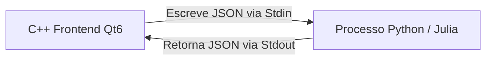

# 📚 Guia de Estudos: Frontend Moderno (Next.js) & Desktop Nativo (C++ Qt6)
**Foco: Integração Científica com Python e Julia**

Este guia foi elaborado para consolidar o seu aprendizado em desenvolvimento frontend web/desktop e detalhar as estratégias para conectar interfaces nativas a motores de cálculo em Python e Julia.

---

## 🌐 Parte 1: Frontend Web Moderno com Next.js

O Next.js é o framework React de referência para web apps rápidos, seguros e otimizados para SEO.

### 1. Arquitetura App Router (`app/`)
Diferente das versões antigas, o Next.js moderno usa a pasta `app/` para roteamento baseado em arquivos:
*   `app/page.jsx` ou `page.tsx`: Corresponde à rota principal `/`.
*   `app/dashboard/page.jsx`: Corresponde à rota `/dashboard`.
*   `app/layout.jsx`: Define o esqueleto HTML global (Sidebar, Navbar, rodapé) compartilhado entre as rotas.

### 2. Server Components vs Client Components
Por padrão, todos os componentes no Next.js são **Server Components** (renderizados no servidor, rápidos e ótimos para SEO).
*   **Quando usar Server Components:** Carregamento inicial de dados direto do banco ou leitura de arquivos.
*   **Quando usar Client Components:** Componentes que exigem interação do usuário, hooks (`useState`, `useEffect`) ou APIs do navegador (ex: eventos de clique, áudio).
    - Para transformar um componente em Client Component, coloque a diretiva `"use client";` na primeira linha do arquivo.

### 3. Exemplo Prático de Fetching Reativo no Next.js:
```javascript
"use client";
import { useState, useEffect } from 'react';

export default function WorkoutsHistory() {
  const [workouts, setWorkouts] = useState([]);

  useEffect(() => {
    // Carrega dados da API em Flask/Python
    fetch('http://localhost:8000/api/workouts')
      .then(res => res.json())
      .then(data => setWorkouts(data))
      .catch(err => console.error(err));
  }, []);

  return (
    <div className="p-4 bg-slate-900 text-white rounded-lg">
      <h2 className="text-xl font-bold">Meus Treinos</h2>
      <ul className="mt-2 space-y-2">
        {workouts.map(w => (
          <li key={w.id} className="border-b border-slate-800 pb-1">
            {w.timestamp} - {w.poison} ({w.goal})
          </li>
        ))}
      </ul>
    </div>
  );
}
```

---

## 🖥️ Parte 2: Desktop Nativo com C++ e Qt6

Para construir interfaces nativas no desktop de alta performance, o **Qt6** com C++ é a escolha ideal, podendo ser estruturado via **Widgets** tradicionais ou **Qt Quick (QML)**.

### 1. Compilação Automatizada com CMake
Para que o compilador C++ encontre os componentes do Qt e compile arquivos de interface `.ui` (feitos no Qt Designer) ou arquivos de código de metadados do Qt, habilitamos o `AUTOUIC` e o `AUTOMOC` no `CMakeLists.txt`:

```cmake
cmake_minimum_required(VERSION 3.16)
project(CalculadoraCientifica VERSION 1.0 LANGUAGES CXX)

# Habilita compilação de Meta-Objetos (Sinais/Slots) e arquivos .ui automaticamente
set(CMAKE_AUTOMOC ON)
set(CMAKE_AUTOUIC ON)
set(CMAKE_AUTOUIC_SEARCH_PATHS ${CMAKE_CURRENT_SOURCE_DIR}/views)

find_package(Qt6 REQUIRED COMPONENTS Core Gui Widgets)

add_executable(CalculadoraCientifica
    src/main.cpp
    src/mainwindow.h
    src/mainwindow.cpp
    views/mainwindow.ui
)

target_link_libraries(CalculadoraCientifica PRIVATE
    Qt6::Core
    Qt6::Gui
    Qt6::Widgets
)
```

---

## ⚡ Parte 3: Integração Híbrida (Python & Julia rodando no Desktop)

Como conectar uma interface rápida em C++ Qt6 a scripts científicos complexos em **Python** (ex: PandaPower) ou **Julia** (ex: otimização matemática)?

A melhor arquitetura de comunicação é o uso de **Pipes Assíncronos via Stdin/Stdout** com a classe `QProcess` do Qt.



### 1. Código C++: Instanciar o processo e enviar dados
Na sua classe `MainWindow` (C++), declaramos um ponteiro para `QProcess` e conectamos o sinal de leitura:

```cpp
// mainwindow.h
#include <QProcess>

class MainWindow : public QMainWindow {
    Q_OBJECT
public:
    MainWindow(QWidget *parent = nullptr);
private slots:
    void dispararCalculo();
    void lerResposta();
private:
    QProcess *processoCalculo;
};
```

```cpp
// mainwindow.cpp
#include "mainwindow.h"
#include <QJsonDocument>
#include <QJsonObject>
#include <QJsonArray>

MainWindow::MainWindow(QWidget *parent) : QMainWindow(parent) {
    processoCalculo = new QProcess(this);
    connect(processoCalculo, &QProcess::readyReadStandardOutput, this, &MainWindow::lerResposta);
    
    // Inicia o script Python em segundo plano
    processoCalculo->start("python3", QStringList() << "calculos.py");
}

void MainWindow::dispararCalculo() {
    // 1. Prepara dados de input em formato JSON
    QJsonObject inputJson;
    inputJson["acao"] = "CALCULAR_IMPEDANCIA";
    inputJson["resistencia"] = 10.0;
    inputJson["indutancia"] = 0.1;
    inputJson["frequencia"] = 60.0;

    QJsonDocument doc(inputJson);
    
    // 2. Envia para o Stdin do Python (com quebra de linha obrigatória)
    processoCalculo->write(doc.toJson(QJsonDocument::Compact) + "\n");
}

void MainWindow::lerResposta() {
    // 3. Lê o Stdout do processo Python
    QByteArray rawData = processoCalculo->readAllStandardOutput().trimmed();
    QJsonDocument doc = QJsonDocument::fromJson(rawData);
    QJsonObject response = doc.object();

    double modulo = response["modulo"].toDouble();
    // Atualiza a tela com o resultado...
}
```

### 2. Código Python (`calculos.py`): Escutando e calculando
O script Python roda em um loop contínuo lendo da entrada padrão (`sys.stdin`):

```python
import sys
import json

def calcular_impedancia(R, L, f):
    import math
    w = 2 * math.pi * f
    XL = w * L
    # Impedância complexa Z = R + j*XL
    modulo = math.sqrt(R**2 + XL**2)
    return {"modulo": modulo, "fase": math.degrees(math.atan2(XL, R))}

if __name__ == "__main__":
    for linha in sys.stdin:
        if not linha.strip():
            continue
        try:
            req = json.loads(linha)
            if req.get("acao") == "CALCULAR_IMPEDANCIA":
                res = calcular_impedancia(
                    req["resistencia"],
                    req["indutancia"],
                    req["frequencia"]
                )
                # Escreve o resultado em formato JSON no Stdout para o C++ ler
                print(json.dumps(res), flush=True)
        except Exception as e:
            print(json.dumps({"erro": str(e)}), flush=True)
```

### 3. Chamando Julia a partir da interface C++
Para chamar um script **Julia**, a lógica é idêntica! Apenas iniciamos o `QProcess` apontando para o binário do Julia:

```cpp
processoCalculo->start("julia", QStringList() << "calculos.jl");
```

No arquivo Julia (`calculos.jl`), escutamos o stdin de forma nativa e lemos os inputs JSON:

```julia
using JSON

function resolver_sistema(A, B)
    # Executa a divisão matricial rápida em Julia
    return A \ B
end

while !eof(stdin)
    linha = readline(stdin)
    if isempty(strip(linha))
        continue
    end
    try
        req = JSON.parse(linha)
        if req["acao"] == "RESOLVER_MATRIZ"
            # Extrai e converte dados
            A = hcat(req["matriz_A"]...) # Converte vetor de vetores em matriz
            B = req["vetor_B"]
            x = resolver_sistema(A, B)
            
            # Retorna o resultado para o C++
            println(JSON.json(Dict("status" => "sucesso", "resultado" => x)))
            flush(stdout)
        end
    catch e
        println(JSON.json(Dict("status" => "erro", "mensagem" => string(e))))
        flush(stdout)
    end
end
```

---

> [!TIP]
> **Benefício desta Arquitetura Híbrida:** 
> Você obtém uma interface desktop extremamente leve, responsiva e robusta compilada em C++ (Qt6), enquanto delega toda a complexidade científica de fluxos de carga e matrizes elétricas para linguagens especializadas (Python/Julia) em segundo plano, sem travar a tela principal (UI Thread).
