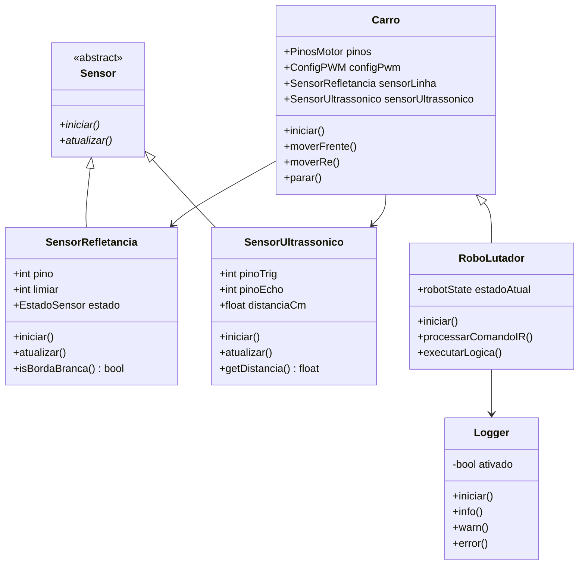

# Resumo

Este artigo documenta a modelagem, a análise de circuitos e a implementação orientada a objetos (POO em C++) do robô autonomo de combate tipo Sumô do Grupo 1 para a disciplina de Laboratório de Engenharia Elétrica da Universidade Federal Fluminense (UFF). A arquitetura eletrotécnica inclui alimentação primária por bateria Li-Ion 2S (7,4V), regulador chaveado Buck 5V, ponte H L298N para controle de potência dos motores DC, receptor infravermelho KY-022 decodificando comandos da fabricante Sony (teclas 1 a 4), sensor ultrassônico HC-SR04 para detecção do oponente e fotorresistor de refletância QRE1113 para segurança da borda da arena. São apresentadas a tabela verdade completa em Pandas com minimização lógica via Soma de Produtos (SOP) e a solução em máquina de estados finitos (`robotState`) que resolve a retenção no estado de término (FIM).


---

# 1. Arquitetura Eletrotécnica e Alimentação

A malha elétrica do robô distribui energia em dois níveis de tensão para isolar o ruído gerado pelas comutações indutivas dos motores:

```text
                 PACK 2S Li-Ion
                   7,4 V nominal
                       │
                 ┌─────┴─────┐
                 │           │
                 ▼           ▼
             L298N        Buck 5 V
           alimentação      │
             motores        │
                 │          ▼
              Motores     Arduino Nano
                             │
                ┌─────────────┼─────────────┐
                │             │             │
                ▼             ▼             ▼
             HC-SR04        QRE          KY-022
           ultrassônico    reflexão       IR
```

## 1.1 Especificações da Eletrônica de Potência e Controle

1. **Pack 2S Li-Ion (7,4V Nominal):** Fornece tensão de potência direta para o barramento $V_{CC}$ da Ponte H L298N.
2. **Módulo Regulador Buck (5V DC):** Rebaixa os 7,4V para 5V regulados e alimenta o **Arduino Nano** e os sensores periféricos.
3. **Ponte H L298N:** Aciona 2 motores DC através de sinais PWM digitais gerados pelos pinos D5, D6, D9 e D10.

---

# 2. Tabela Verdade e Soma de Produtos (SOP / Álgebra Booleana)

As decisões de combate e movimentação do robô são modeladas como uma função lógica combinacional das 4 variáveis digitais de entrada do sistema:

- $E_3$ (IR Sony Botão 3 / Stop): $1$ se o botão PARAR for ativado.
- $E_2$ (IR Sony Botão 2 / Start): $1$ se a varredura/combate for ativada.
- $E_1$ (Sensor Ultrassônico HC-SR04): $1$ se o oponente for detectado a menos de $20\,\text{cm}$.
- $E_0$ (Sensor QRE1113 Refletância): $1$ se a borda branca da arena for detectada.

## 2.1 Tabela Verdade Gerada via Python (Pandas)

| $E_3$ (Stop) | $E_2$ (Start) | $E_1$ (Inimigo) | $E_0$ (Borda) | $S_{\text{Frente}}$ | $S_{\text{Ré}}$ | $S_{\text{Parar}}$ | Estado do Robô (`robotState`) |
| :---: | :---: | :---: | :---: | :---: | :---: | :---: | :--- |
| 0 | 0 | 0 | 0 | 0 | 0 | 1 | `ESTADO_PARADO` |
| 0 | 0 | 0 | 1 | 0 | 1 | 0 | `ESTADO_ESQUIVAR_BORDA` |
| 0 | 0 | 1 | 0 | 0 | 0 | 1 | `ESTADO_PARADO` |
| 0 | 0 | 1 | 1 | 0 | 1 | 0 | `ESTADO_ESQUIVAR_BORDA` |
| 0 | 1 | 0 | 0 | 0 | 1 | 0 | `ESTADO_BUSCAR` |
| 0 | 1 | 0 | 1 | 0 | 1 | 0 | `ESTADO_ESQUIVAR_BORDA` |
| 0 | 1 | 1 | 0 | **1** | 0 | 0 | **`ESTADO_ATACAR`** |
| 0 | 1 | 1 | 1 | 0 | 1 | 0 | `ESTADO_ESQUIVAR_BORDA` |
| **1** | x | x | x | 0 | 0 | **1** | **`ESTADO_PARADO_DEFINITIVO (FIM)`** |

## 2.2 Equações Minimizadas de Soma de Produtos (SOP)

- **Avançar Frente ($S_{\text{Frente}}$ - Carga Máxima):**
  $$S_{\text{Frente}} = \overline{E_3} \cdot E_2 \cdot E_1 \cdot \overline{E_0}$$

- **Marcha Ré / Busca ($S_{\text{Ré}}$):**
  $$S_{\text{Ré}} = \overline{E_3} \cdot E_0 + \overline{E_3} \cdot E_2 \cdot \overline{E_1}$$

- **Parar Motores / Emergência ($S_{\text{Parar}}$):**
  $$S_{\text{Parar}} = E_3 + \overline{E_2} \cdot \overline{E_0}$$

---

# 3. Modelagem Orientada a Objetos (C++ em Arduino)

A arquitetura de software implementa as 4 leis fundamentais da POO:



---

# 4. Solução do Fluxograma: Trava no Estado FIM

## 4.1 Problema Apresentado
No fluxograma clássico de loops de Arduino, ao pressionar o botão de parada (Botão 3), a função `loop()` reinicia continuamente, fazendo o robô retornar ao início do programa e voltar a se mover caso não haja retenção de estado.

## 4.2 Solução Implementada em POO
Definiu-se a enumeração de estados `robotState`:

```cpp
enum robotState {
    ESTADO_PARADO,
    ESTADO_PREPARAR,
    ESTADO_BUSCAR,
    ESTADO_ATACAR,
    ESTADO_ESQUIVAR_BORDA,
    ESTADO_PARADO_DEFINITIVO // ESTADO FIM DO FLUXOGRAMA
};
```

Quando o **Botão 3 (`0x82`)** é decodificado pelo receptor IR Sony:
1. A variável de membro `estadoAtual` transita para `ESTADO_PARADO_DEFINITIVO`.
2. A função `parar()` desliga imediatamente todas as saídas da Ponte H L298N.
3. No `switch (estadoAtual)`, a função `executarLogica()` permanece no caso `ESTADO_PARADO_DEFINITIVO`, garantindo que o robô fique inerte em repouso absoluto sem retornar à rotina de busca de combate.

---

# 5. Código Fonte C++ Completo do Robô

```cpp
// ===================================================================================
// ARDUINO SKETCH: ROBÔ LUTADOR SUMÔ (POO & FSM) - UFF 2026
// ===================================================================================

#include <IRremote.hpp>
#include "headers.h"
#include "Logger.h"

Logger logger(true, LOG_INFO);

// Classe Base Abstrata: Sensor
class Sensor {
public:
    virtual void iniciar() = 0;
    virtual void atualizar() = 0;
    virtual ~Sensor() {}
};

// Subclasse SensorRefletancia (QRE1113)
class SensorRefletancia : public Sensor {
public:
    int pino;
    int limiar;
    EstadoSensor estado;

    SensorRefletancia(int pinoSensor, int limiarBranco = LIMIAR_BORDA_QRE)
        : pino(pinoSensor), limiar(limiarBranco) {
        estado.valorQRE = 0;
        estado.naBordaBranca = false;
    }

    void iniciar() override { pinMode(pino, INPUT); }
    void atualizar() override {
        estado.valorQRE = analogRead(pino);
        estado.naBordaBranca = (estado.valorQRE < limiar);
    }
    bool isBordaBranca() const { return estado.naBordaBranca; }
};

// Subclasse SensorUltrassonico (HC-SR04)
class SensorUltrassonico : public Sensor {
public:
    int pinoTrig, pinoEcho;
    float distanciaCm;

    SensorUltrassonico(int trigPin, int echoPin)
        : pinoTrig(trigPin), pinoEcho(echoPin), distanciaCm(999.0) {}

    void iniciar() override {
        pinMode(pinoTrig, OUTPUT);
        pinMode(pinoEcho, INPUT);
        digitalWrite(pinoTrig, LOW);
    }

    void atualizar() override {
        digitalWrite(pinoTrig, LOW); delayMicroseconds(2);
        digitalWrite(pinoTrig, HIGH); delayMicroseconds(10);
        digitalWrite(pinoTrig, LOW);
        long duracao = pulseIn(pinoEcho, HIGH, 25000);
        distanciaCm = (duracao == 0) ? 999.0 : (duracao * 0.0343) / 2.0;
    }

    float getDistancia() const { return distanciaCm; }
};

// Classe Pública Carro
class Carro {
public:
    PinosMotor pinos;
    ConfigPWM configPwm;
    SensorRefletancia sensorLinha;
    SensorUltrassonico sensorUltrassonico;

    Carro(int pinoLinha, int trigPin, int echoPin, PinosMotor pinosM, ConfigPWM pwm)
        : pinos(pinosM), configPwm(pwm),
          sensorLinha(pinoLinha), sensorUltrassonico(trigPin, echoPin) {}

    virtual void iniciar() {
        pinMode(pinos.in1, OUTPUT); pinMode(pinos.in2, OUTPUT);
        pinMode(pinos.in3, OUTPUT); pinMode(pinos.in4, OUTPUT);
        sensorLinha.iniciar(); sensorUltrassonico.iniciar();
        parar();
    }

    virtual void atualizarSensores() {
        sensorLinha.atualizar();
        sensorUltrassonico.atualizar();
    }

    void moverFrente(int vel = -1) {
        int v = (vel < 0) ? configPwm.maxPotencia : vel;
        analogWrite(pinos.in1, v); digitalWrite(pinos.in2, LOW);
        analogWrite(pinos.in3, v); digitalWrite(pinos.in4, LOW);
    }

    void moverRe(int vel = -1) {
        int v = (vel < 0) ? configPwm.re : vel;
        digitalWrite(pinos.in1, LOW); analogWrite(pinos.in2, v);
        digitalWrite(pinos.in3, LOW); analogWrite(pinos.in4, v);
    }

    void parar() {
        digitalWrite(pinos.in1, LOW); digitalWrite(pinos.in2, LOW);
        digitalWrite(pinos.in3, LOW); digitalWrite(pinos.in4, LOW);
    }

    bool detectouBorda() const { return sensorLinha.isBordaBranca(); }
    float getDistanciaOponente() const { return sensorUltrassonico.getDistancia(); }
};

// Classe Final RoboLutador
class RoboLutador : public Carro {
public:
    robotState estadoAtual;

    RoboLutador(int pinoLinha, int trigPin, int echoPin, PinosMotor pinosM, ConfigPWM pwm)
        : Carro(pinoLinha, trigPin, echoPin, pinosM, pwm), estadoAtual(ESTADO_PARADO) {}

    void iniciar() override {
        Carro::iniciar();
        IrReceiver.begin(IR_RECEIVE_PIN);
        estadoAtual = ESTADO_PARADO;
        logger.info(F("🤖 RoboLutador Inicializado!"));
    }

    void processarComandoIR() {
        if (IrReceiver.decode()) {
            uint32_t codigo = IrReceiver.decodedIRData.decodedRawData;
            IrReceiver.resume();

            switch (codigo) {
                case BUTTON_1_CODE: estadoAtual = ESTADO_PREPARAR; break;
                case BUTTON_2_CODE: estadoAtual = ESTADO_BUSCAR; break;
                case BUTTON_3_CODE: estadoAtual = ESTADO_PARADO_DEFINITIVO; parar(); break;
                case BUTTON_4_CODE: estadoAtual = ESTADO_PARADO; parar(); break;
            }
        }
    }

    virtual void executarLogica() {
        atualizarSensores();
        processarComandoIR();

        if (detectouBorda() && estadoAtual != ESTADO_PARADO && estadoAtual != ESTADO_PARADO_DEFINITIVO) {
            estadoAtual = ESTADO_ESQUIVAR_BORDA;
        }

        switch (estadoAtual) {
            case ESTADO_PARADO: parar(); break;
            case ESTADO_PREPARAR: moverFrente(150); break;
            case ESTADO_BUSCAR: {
                float D = getDistanciaOponente();
                if (D < DISTANCIA_ATENCAO_CM) estadoAtual = ESTADO_ATACAR;
                else moverRe(configPwm.re);
                break;
            }
            case ESTADO_ATACAR:
                if (getDistanciaOponente() < 50.0) moverFrente(configPwm.maxPotencia);
                else estadoAtual = ESTADO_BUSCAR;
                break;
            case ESTADO_ESQUIVAR_BORDA:
                moverRe(configPwm.re); delay(400);
                estadoAtual = ESTADO_BUSCAR;
                break;
            case ESTADO_PARADO_DEFINITIVO:
                parar(); // Estado FIM travado
                break;
        }
    }
};

PinosMotor pinosMotores = { IN1_MOTOR_ESQUERDO, IN2_MOTOR_ESQUERDO, IN3_MOTOR_DIREITO, IN4_MOTOR_DIREITO };
ConfigPWM configuracaoPwm = { 255, 200, 190 };
RoboLutador robo(PIN_SENSOR_QRE_LINHA, PIN_ULTRASSONICO_TRIG, PIN_ULTRASSONICO_ECHO, pinosMotores, configuracaoPwm);

void setup() { logger.iniciar(9600); robo.iniciar(); }
void loop() { robo.executarLogica(); }
```

---

# 6. Conclusão

A arquitetura desenvolvida une o rigor conceitual da Engenharia Elétrica (alimentação de motores via L298N isolada por Buck 5V) ao formalismo da Ciência da Computação (POO em C++ com `Sensor`, `Carro`, `RoboLutador`, `Logger` e a máquina de estados `robotState`). A modelagem booleana comprovou a consistência lógica das manobras de ataque e segurança, enquanto a transição para o estado `ESTADO_PARADO_DEFINITIVO` resolveu a retenção segura no término do loop de combate.
